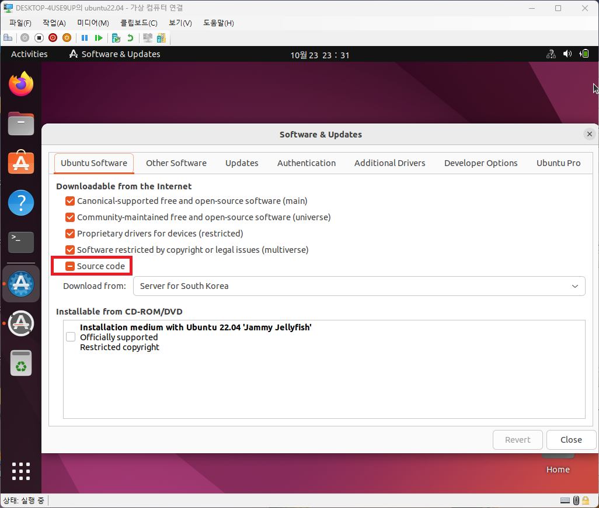

# Quick Start
## Environment
- **Virtual Machine**
    - Hyper-V
- **OS**
    - Ubuntu 22.04
- **CPU**
    - Intel(R) Core(TM) i7-10510U CPU @ 1.80GHz
- **Components**
    - arm-gnu-toolchain-12.2.rel1-x86_64-aarch64-none-linux-gnu
    - qemu-v8.1.2
    - Arm-Trusted-Firmware-v.2.8.9-LTS
    - EDK2-v2023.08
        - berkeley-softfloat-3-2023-10-21
        - brotli-v1.1.0
        - openssl-v3.1.3
        - oniguruma-v6.9.9
        - pylibfdt-v1.6.1
        - public-mipi-sys-t-v1.1+edk2
        - jansson-v2.14
        - edk2-cmocka-cmocka-v1.1.5'
        - googletest-v1.14.0
        - subhook-v0.8.2
    - linux-v6.4
    - buildroot-v2023.08.02

## Step 0. Prepare
- **'Source Code' checkbox should be checked in Softare & Updates**


## Step 1. Installing Essential Packages
- **Run the script below**
    ```
    [ qemu_aarch64_linux/scripts ]
    # ./install_dev_packages.sh
    ...
    ```

## Step 2. Build QEMU( ARM64 Emulator )
### Step 2-1. Configuration
- **Run the script below**
    ```
    [ qemu_aarch64_linux ]
    # make qconfig
    ...
    ```
### Step 2-2. Build
- **Run the script below**
    ```
    [ qemu_aarch64_linux ]
    # make qbuild
    ...
    output at 'qemu_aarch64_linux/build/qemu'
    ```

## Step 3. Build TF-A( Arm-Trusted-Firmware. A-Profile )
- **Run the script below**
    ```
    [ qemu_aarch64_linux ]
    # make build_tf-a
    ...
    output at 'qemu_aarch64_linux/build/arm-trusted-firmware'
    and shipped binaries, 'bl1.bin' 'bl2.bin', 'bl31.bin', to top direcotry
    ```

## Step 4. Build EDK2( UEFI )
- **Run the script below**
    ```
    [ qemu_aarch64_linux ]
    # make build_edk2
    ...
    output at 'qemu_aarch64_linux/edk2/Build/ArmVirtQemuKernel-AARCH64/DEBUG_GCC5'
    and shipped binaries, 'QEMU_EFI.fd', to top direcotry as 'bl33.bin'
    ```

## Step 5. Build Linux Kernel
### Step 5-1. Configuration
- **Run the script below**
    ```
    [ qemu_aarch64_linux ]
    # make kconfig
    ...
    ```
### Step 5-2. Build
- **Run the script below**
    ```
    [ qemu_aarch64_linux ]
    # make kbuild
    ...
    output at 'qemu_aarch64_linux/build/linux'
    ```

## Step 6. Build Linux Kernel
### Step 6-1. Configuration
- **Run the script below**
    ```
    [ qemu_aarch64_linux ]
    # make rconfig
    ...
    ```
### Step 6-2. Build
- **Run the script below**
    ```
    [ qemu_aarch64_linux ]
    # make rbuild
    ...
    output at 'qemu_aarch64_linux/build/buildroot'
    ```

## Step 7. Run QEMU
- **Run the script below**
    - Note. login information
        - ID: root
        - PW: root 
    ```
    [ qemu_aarch64_linux ]
    # make run
    /home/dylan7h/workspace/github/qemu_aarch64_linux/build/qemu/qemu-system-aarch64 -M virt,gic-version=2,virtualization=off,secure=on,acpi=off -cpu cortex-a72 -smp 2 -m 1G -bios bl1.bin -kernel /home/dylan7h/workspace/github/qemu_aarch64_linux/build/linux/arch/arm64/boot/Image -append "rootwait root=/dev/vda console=ttyAMA0" -netdev user,id=eth0 -device virtio-net-device,netdev=eth0 -drive file=/home/dylan7h/workspace/github/qemu_aarch64_linux/build/buildroot/images/rootfs.ext4,if=none,format=raw,id=hd0 -device virtio-blk-device,drive=hd0 -d unimp -semihosting-config enable=on -nographic
    NOTICE:  Booting Trusted Firmware
    NOTICE:  BL1: lts-v2.8.9(release):d5f6bb20b
    NOTICE:  BL1: Built : 22:44:14, Oct 22 2023
    NOTICE:  BL1: Booting BL2
    NOTICE:  BL2: lts-v2.8.9(release):d5f6bb20b
    NOTICE:  BL2: Built : 22:44:18, Oct 22 2023
    NOTICE:  BL1: Booting BL31
    NOTICE:  BL31: lts-v2.8.9(release):d5f6bb20b
    NOTICE:  BL31: Built : 22:44:25, Oct 22 2023
    Loading driver at 0x00060009160 EntryPoint=0x00000000000
    ArmVirtGetMemoryMap: Dumping System DRAM Memory Map:
            PhysicalBase: 0x40000000
            VirtualBase: 0x40000000
            Length: 0x40000000
    UEFI firmware (version  built at 22:53:31 on Oct 22 2023)
    PlatformPeim: PL011 UART @ 0x9000000
    add-symbol-file /home/dylan7h/workspace/github/qemu_aarch64_linux/edk2/Build/ArmVirtQemuKernel-AARCH64/DEBUG_GCC5/AARCH64/MdeModulePkg/Core/Dxe/DxeMain/DEBUG/DxeCore.dll 0x7F2BA000
    Loading DxeCore at 0x007F2B9000 EntryPoint=0x007F2C2AE0
    DxeMain: MemoryBaseAddress=0x40000000 MemoryLength=0x3C000000
    add-symbol-file /home/dylan7h/workspace/github/qemu_aarch64_linux/edk2/Build/ArmVirtQemuKernel-AARCH64/DEBUG_GCC5/AARCH64/MdeModulePkg/Core/Dxe/DxeMain/DEBUG/DxeCore.dll 0x7F2BA000
    HOBLIST address in DXE = 0x7BA36018
    Memory Allocation 0x00000004 0x7FFFB000 - 0x7FFFBFFF
    Memory Allocation 0x00000004 0x7FFFA000 - 0x7FFFAFFF
    Memory Allocation 0x00000004 0x7FFF9000 - 0x7FFF9FFF
    Memory Allocation 0x00000004 0x7FFF8000 - 0x7FFF8FFF
    Memory Allocation 0x00000004 0x7FFF7000 - 0x7FFF7FFF
    Memory Allocation 0x00000004 0x7FFF6000 - 0x7FFF6FFF
    Memory Allocation 0x00000004 0x7F299000 - 0x7F2B8FFF
    Memory Allocation 0x00000004 0x7FFF3000 - 0x7FFF5FFF
    Memory Allocation 0x00000004 0x7FFE3000 - 0x7FFF2FFF
    Memory Allocation 0x00000004 0x7F972000 - 0x7FFE2FFF
    Memory Allocation 0x00000004 0x7F301000 - 0x7F971FFF
    Memory Allocation 0x00000003 0x7F2B9000 - 0x7F300FFF
    Memory Allocation 0x00000003 0x7F2B9000 - 0x7F300FFF
    Memory Allocation 0x00000004 0x7F299000 - 0x7F2B8FFF
    Memory Allocation 0x00000007 0x7FFFC000 - 0x7FFFFFFF
    FV Hob            0x60008000 - 0x601FFFFF
    FV Hob            0x7F301000 - 0x7F97053F
    FV2 Hob           0x7F301000 - 0x7F97053F
                    64074AFE-340A-4BE6-94BA-91B5B4D0F71E - 9E21FD93-9C72-4C15-8C4B-E77F1DB2D792
    InstallProtocolInterface: D8117CFE-94A6-11D4-9A3A-0090273FC14D 7F2E3E40
    InstallProtocolInterface: 8F644FA9-E850-4DB1-9CE2-0B44698E8DA4 7BA32230
    InstallProtocolInterface: 09576E91-6D3F-11D2-8E39-00A0C969723B 7BA32718
    InstallProtocolInterface: 8F644FA9-E850-4DB1-9CE2-0B44698E8DA4 7BA323B0
    InstallProtocolInterface: 09576E91-6D3F-11D2-8E39-00A0C969723B 7BA32498
    InstallProtocolInterface: 220E73B6-6BDB-4413-8405-B974B108619A 7B893CB0
    InstallProtocolInterface: 220E73B6-6BDB-4413-8405-B974B108619A 7B893830
    InstallProtocolInterface: FC1BCDB0-7D31-49AA-936A-A4600D9DD083 7F2E3BE8
    Loading driver 9B680FCE-AD6B-4F3A-B60B-F59899003443
    InstallProtocolInterface: 5B1B31A1-9562-11D2-8E3F-00A0C969723B 7B2452C0
    add-symbol-file /home/dylan7h/workspace/github/qemu_aarch64_linux/edk2/Build/ArmVirtQemuKernel-AARCH64/DEBUG_GCC5/AARCH64/MdeModulePkg/Universal/DevicePathDxe/DevicePathDxe/DEBUG/DevicePathDxe.dll 0x7BE12000
    Loading driver at 0x0007BE11000 EntryPoint=0x0007BE1A02C DevicePathDxe.efi
    InstallProtocolInterface: BC62157E-3E33-4FEC-9920-2D3B36D750DF 7B245618
    ProtectUefiImageCommon - 0x7B2452C0
    - 0x000000007BE11000 - 0x000000000000F000
    InstallProtocolInterface: 0379BE4E-D706-437D-B037-EDB82FB772A4 7BE1D888
    InstallProtocolInterface: 8B843E20-8132-4852-90CC-551A4E4A7F1C 7BE1D878
    InstallProtocolInterface: 05C99A21-C70F-4AD2-8A5F-35DF3343F51E 7BE1D868
    Loading driver 80CF7257-87AB-47F9-A3FE-D50B76D89541
    InstallProtocolInterface: 5B1B31A1-9562-11D2-8E3F-00A0C969723B 7B20D7C0
    add-symbol-file /home/dylan7h/workspace/github/qemu_aarch64_linux/edk2/Build/ArmVirtQemuKernel-AARCH64/DEBUG_GCC5/AARCH64/MdeModulePkg/Universal/PCD/Dxe/Pcd/DEBUG/PcdDxe.dll 0x7BE08000
    Loading driver at 0x0007BE07000 EntryPoint=0x0007BE0BEDC PcdDxe.efi
    InstallProtocolInterface: BC62157E-3E33-4FEC-9920-2D3B36D750DF 7B20D718
    ProtectUefiImageCommon - 0x7B20D7C0
    - 0x000000007BE07000 - 0x000000000000A000
    InstallProtocolInterface: 11B34006-D85B-4D0A-A290-D5A571310EF7 7BE0F190
    InstallProtocolInterface: 13A3F0F6-264A-3EF0-F2E0-DEC512342F34 7BE0F0F0
    InstallProtocolInterface: 5BE40F57-FA68-4610-BBBF-E9C5FCDAD365 7BE0F0C8
    InstallProtocolInterface: FD0F4478-0EFD-461D-BA2D-E58C45FD5F5E 7BE0F0A8
    Loading driver 9A871B00-1C16-4F61-8D2C-93B6654B5AD6
    InstallProtocolInterface: 5B1B31A1-9562-11D2-8E3F-00A0C969723B 7B21D3C0
    add-symbol-file /home/dylan7h/workspace/github/qemu_aarch64_linux/edk2/Build/ArmVirtQemuKernel-AARCH64/DEBUG_GCC5/AARCH64/EmbeddedPkg/Drivers/FdtClientDxe/FdtClientDxe/DEBUG/FdtClientDxe.dll 0x7BE00000
    Loading driver at 0x0007BDFF000 EntryPoint=0x0007BE02900 FdtClientDxe.efi
    InstallProtocolInterface: BC62157E-3E33-4FEC-9920-2D3B36D750DF 7B21D798
    ProtectUefiImageCommon - 0x7B21D3C0
    - 0x000000007BDFF000 - 0x0000000000008000
    InitializeFdtClientDxe: DTB @ 0x7FFF3000
    InstallProtocolInterface: E11FACA0-4710-4C8E-A7A2-01BAA2591B4C 7BE05030
    Loading driver B601F8C4-43B7-4784-95B1-F4226CB40CEE
    InstallProtocolInterface: 5B1B31A1-9562-11D2-8E3F-00A0C969723B 7B21C140
    add-symbol-file /home/dylan7h/workspace/github/qemu_aarch64_linux/edk2/Build/ArmVirtQemuKernel-AARCH64/DEBUG_GCC5/AARCH64/MdeModulePkg/Core/RuntimeDxe/RuntimeDxe/DEBUG/RuntimeDxe.dll 0x7BE70000
    Loading driver at 0x0007BE60000 EntryPoint=0x0007BE71928 RuntimeDxe.efi
    InstallProtocolInterface: BC62157E-3E33-4FEC-9920-2D3B36D750DF 7B21CE18
    ProtectUefiImageCommon - 0x7B21C140
    - 0x000000007BE60000 - 0x0000000000040000
    InstallProtocolInterface: B7DFB4E1-052F-449F-87BE-9818FC91B733 7BE80030
    Loading driver F80697E9-7FD6-4665-8646-88E33EF71DFC
    InstallProtocolInterface: 5B1B31A1-9562-11D2-8E3F-00A0C969723B 7B21C540
    add-symbol-file /home/dylan7h/workspace/github/qemu_aarch64_linux/edk2/Build/ArmVirtQemuKernel-AARCH64/DEBUG_GCC5/AARCH64/MdeModulePkg/Universal/SecurityStubDxe/SecurityStubDxe/DEBUG/SecurityStubDxe.dll 0x7BDF9000
    Loading driver at 0x0007BDF8000 EntryPoint=0x0007BDFAA50 SecurityStubDxe.efi
    InstallProtocolInterface: BC62157E-3E33-4FEC-9920-2D3B36D750DF 7B213B18
    ProtectUefiImageCommon - 0x7B21C540
    - 0x000000007BDF8000 - 0x0000000000007000
    InstallProtocolInterface: 94AB2F58-1438-4EF1-9152-18941A3A0E68 7BDFD0B0
    InstallProtocolInterface: A46423E3-4617-49F1-B9FF-D1BFA9115839 7BDFD0A8
    InstallProtocolInterface: 15853D7C-3DDF-43E0-A1CB-EBF85B8F872C 7BDFD090
    Loading driver 4C6E0267-C77D-410D-8100-1495911A989D
    InstallProtocolInterface: 5B1B31A1-9562-11D2-8E3F-00A0C969723B 7B2131C0
    add-symbol-file /home/dylan7h/workspace/github/qemu_aarch64_linux/edk2/Build/ArmVirtQemuKernel-AARCH64/DEBUG_GCC5/AARCH64/EmbeddedPkg/MetronomeDxe/MetronomeDxe/DEBUG/MetronomeDxe.dll 0x7BDF3000
    Loading driver at 0x0007BDF2000 EntryPoint=0x0007BDF42CC MetronomeDxe.efi
    InstallProtocolInterface: BC62157E-3E33-4FEC-9920-2D3B36D750DF 7B213518
    ProtectUefiImageCommon - 0x7B2131C0
    - 0x000000007BDF2000 - 0x0000000000006000
    InstallProtocolInterface: 26BACCB2-6F42-11D4-BCE7-0080C73C8881 7BDF6030
    Loading driver 348C4D62-BFBD-4882-9ECE-C80BB1C4783B
    InstallProtocolInterface: 5B1B31A1-9562-11D2-8E3F-00A0C969723B 7B21BBC0
    add-symbol-file /home/dylan7h/workspace/github/qemu_aarch64_linux/edk2/Build/ArmVirtQemuKernel-AARCH64/DEBUG_GCC5/AARCH64/MdeModulePkg/Universal/HiiDatabaseDxe/HiiDatabaseDxe/DEBUG/HiiDatabase.dll 0x7BDD4000
    Loading driver at 0x0007BDD3000 EntryPoint=0x0007BDD7754 HiiDatabase.efi
    InstallProtocolInterface: BC62157E-3E33-4FEC-9920-2D3B36D750DF 7B21B118
    ProtectUefiImageCommon - 0x7B21BBC0
    - 0x000000007BDD3000 - 0x000000000001F000
    InstallProtocolInterface: E9CA4775-8657-47FC-97E7-7ED65A084324 7BDF0110
    InstallProtocolInterface: 0FD96974-23AA-4CDC-B9CB-98D17750322A 7BDF0188
    InstallProtocolInterface: EF9FC172-A1B2-4693-B327-6D32FC416042 7BDF01B0
    InstallProtocolInterface: 587E72D7-CC50-4F79-8209-CA291FC1A10F 7BDF0208
    InstallProtocolInterface: 0A8BADD5-03B8-4D19-B128-7B8F0EDAA596 7BDF0238
    InstallProtocolInterface: 31A6406A-6BDF-4E46-B2A2-EBAA89C40920 7BDF0130
    InstallProtocolInterface: 1A1241E6-8F19-41A9-BC0E-E8EF39E06546 7BDF0158
    Loading driver 9A5163E7-5C29-453F-825C-837A46A81E15
    InstallProtocolInterface: 5B1B31A1-9562-11D2-8E3F-00A0C969723B 7B21AB40
    add-symbol-file /home/dylan7h/workspace/github/qemu_aarch64_linux/edk2/Build/ArmVirtQemuKernel-AARCH64/DEBUG_GCC5/AARCH64/MdeModulePkg/Universal/SerialDxe/SerialDxe/DEBUG/SerialDxe.dll 0x7BDCE000
    Loading driver at 0x0007BDCD000 EntryPoint=0x0007BDCF914 SerialDxe.efi
    InstallProtocolInterface: BC62157E-3E33-4FEC-9920-2D3B36D750DF 7B21AE18
    ProtectUefiImageCommon - 0x7B21AB40
    - 0x000000007BDCD000 - 0x0000000000006000
    InstallProtocolInterface: BB25CF6F-F1D4-11D2-9A0C-0090273FC1FD 7BDD1040
    InstallProtocolInterface: 09576E91-6D3F-11D2-8E39-00A0C969723B 7BDD1088
    Loading driver D93CE3D8-A7EB-4730-8C8E-CC466A9ECC3C
    InstallProtocolInterface: 5B1B31A1-9562-11D2-8E3F-00A0C969723B 7B21A140
    add-symbol-file /home/dylan7h/workspace/github/qemu_aarch64_linux/edk2/Build/ArmVirtQemuKernel-AARCH64/DEBUG_GCC5/AARCH64/MdeModulePkg/Universal/ReportStatusCodeRouter/RuntimeDxe/ReportStatusCodeRouterRuntimeDxe/DEBUG/ReportStatusCodeRouterRuntimeDxe.dll Loading driver at 0x00078AF0000 EntryPoint=0x00078B01E14 ReportStatusCodeRouterRuntimeDxe.efi
    InstallProtocolInterface: BC62157E-3E33-4FEC-9920-2D3B36D750DF 7B21A498
    ProtectUefiImageCommon - 0x7B21A140
    - 0x0000000078AF0000 - 0x0000000000040000
    InstallProtocolInterface: 86212936-0E76-41C8-A03A-2AF2FC1C39E2 78B10068
    InstallProtocolInterface: D2B2B828-0826-48A7-B3DF-983C006024F0 78B10050
    Loading driver A210F973-229D-4F4D-AA37-9895E6C9EABA
    InstallProtocolInterface: 5B1B31A1-9562-11D2-8E3F-00A0C969723B 7B219140
    add-symbol-file /home/dylan7h/workspace/github/qemu_aarch64_linux/edk2/Build/ArmVirtQemuKernel-AARCH64/DEBUG_GCC5/AARCH64/NetworkPkg/DpcDxe/DpcDxe/DEBUG/DpcDxe.dll 0x7BDC8000
    Loading driver at 0x0007BDC7000 EntryPoint=0x0007BDC9630 DpcDxe.efi
    InstallProtocolInterface: BC62157E-3E33-4FEC-9920-2D3B36D750DF 7B219398
    ProtectUefiImageCommon - 0x7B219140
    - 0x000000007BDC7000 - 0x0000000000006000
    InstallProtocolInterface: 480F8AE9-0C46-4AA9-BC89-DB9FBA619806 7BDCB030
    Loading driver 0049858F-8CA7-4CCD-918B-D952CBF32975
    InstallProtocolInterface: 5B1B31A1-9562-11D2-8E3F-00A0C969723B 7B2194C0
    add-symbol-file /home/dylan7h/workspace/github/qemu_aarch64_linux/edk2/Build/ArmVirtQemuKernel-AARCH64/DEBUG_GCC5/AARCH64/OvmfPkg/Fdt/VirtioFdtDxe/VirtioFdtDxe/DEBUG/VirtioFdtDxe.dll 0x7BDC1000
    Loading driver at 0x0007BDC0000 EntryPoint=0x0007BDC2EC4 VirtioFdtDxe.efi
    InstallProtocolInterface: BC62157E-3E33-4FEC-9920-2D3B36D750DF 7B218B18
    ProtectUefiImageCommon - 0x7B2194C0
    - 0x000000007BDC0000 - 0x0000000000007000
    InstallProtocolInterface: 09576E91-6D3F-11D2-8E39-00A0C969723B 7B218C98
    VirtioMmioInit virtio 0.9.5, id 0
    InstallProtocolInterface: FA920010-6785-4941-B6EC-498C579F160A 7B2180A8
    InstallProtocolInterface: 09576E91-6D3F-11D2-8E39-00A0C969723B 7B218A18
    VirtioMmioInit virtio 0.9.5, id 0
    InstallProtocolInterface: FA920010-6785-4941-B6EC-498C579F160A 7B2181A8
    InstallProtocolInterface: 09576E91-6D3F-11D2-8E39-00A0C969723B 7B218698
    VirtioMmioInit virtio 0.9.5, id 0
    InstallProtocolInterface: FA920010-6785-4941-B6EC-498C579F160A 7B2182A8
    InstallProtocolInterface: 09576E91-6D3F-11D2-8E39-00A0C969723B 7B218398
    VirtioMmioInit virtio 0.9.5, id 0
    InstallProtocolInterface: FA920010-6785-4941-B6EC-498C579F160A 7B2184A8
    InstallProtocolInterface: 09576E91-6D3F-11D2-8E39-00A0C969723B 7B217F18
    VirtioMmioInit virtio 0.9.5, id 0
    InstallProtocolInterface: FA920010-6785-4941-B6EC-498C579F160A 7B217E28
    InstallProtocolInterface: 09576E91-6D3F-11D2-8E39-00A0C969723B 7B217D98
    VirtioMmioInit virtio 0.9.5, id 0
    InstallProtocolInterface: FA920010-6785-4941-B6EC-498C579F160A 7B2170A8
    InstallProtocolInterface: 09576E91-6D3F-11D2-8E39-00A0C969723B 7B217D18
    VirtioMmioInit virtio 0.9.5, id 0
    InstallProtocolInterface: FA920010-6785-4941-B6EC-498C579F160A 7B2178A8
    InstallProtocolInterface: 09576E91-6D3F-11D2-8E39-00A0C969723B 7B217198
    VirtioMmioInit virtio 0.9.5, id 0
    InstallProtocolInterface: FA920010-6785-4941-B6EC-498C579F160A 7B2176A8
    InstallProtocolInterface: 09576E91-6D3F-11D2-8E39-00A0C969723B 7B217518
    VirtioMmioInit virtio 0.9.5, id 0
    InstallProtocolInterface: FA920010-6785-4941-B6EC-498C579F160A 7B217328
    InstallProtocolInterface: 09576E91-6D3F-11D2-8E39-00A0C969723B 7B217498
    VirtioMmioInit virtio 0.9.5, id 0
    InstallProtocolInterface: FA920010-6785-4941-B6EC-498C579F160A 7B216B28
    InstallProtocolInterface: 09576E91-6D3F-11D2-8E39-00A0C969723B 7B216F98
    VirtioMmioInit virtio 0.9.5, id 0
    InstallProtocolInterface: FA920010-6785-4941-B6EC-498C579F160A 7B216CA8
    InstallProtocolInterface: 09576E91-6D3F-11D2-8E39-00A0C969723B 7B216098
    VirtioMmioInit virtio 0.9.5, id 0
    InstallProtocolInterface: FA920010-6785-4941-B6EC-498C579F160A 7B2167A8
    InstallProtocolInterface: 09576E91-6D3F-11D2-8E39-00A0C969723B 7B216918
    VirtioMmioInit virtio 0.9.5, id 0
    InstallProtocolInterface: FA920010-6785-4941-B6EC-498C579F160A 7B2165A8
    InstallProtocolInterface: 09576E91-6D3F-11D2-8E39-00A0C969723B 7B216718
    VirtioMmioInit virtio 0.9.5, id 0
    InstallProtocolInterface: FA920010-6785-4941-B6EC-498C579F160A 7B216228
    InstallProtocolInterface: 09576E91-6D3F-11D2-8E39-00A0C969723B 7B216318
    VirtioMmioInit virtio 0.9.5, id 0
    InstallProtocolInterface: FA920010-6785-4941-B6EC-498C579F160A 7B215028
    InstallProtocolInterface: 09576E91-6D3F-11D2-8E39-00A0C969723B 7B215B98
    VirtioMmioInit virtio 0.9.5, id 0
    InstallProtocolInterface: FA920010-6785-4941-B6EC-498C579F160A 7B215C28
    InstallProtocolInterface: 09576E91-6D3F-11D2-8E39-00A0C969723B 7B215D98
    VirtioMmioInit virtio 0.9.5, id 0
    InstallProtocolInterface: FA920010-6785-4941-B6EC-498C579F160A 7B215AA8
    InstallProtocolInterface: 09576E91-6D3F-11D2-8E39-00A0C969723B 7B215A18
    VirtioMmioInit virtio 0.9.5, id 0
    InstallProtocolInterface: FA920010-6785-4941-B6EC-498C579F160A 7B2151A8
    InstallProtocolInterface: 09576E91-6D3F-11D2-8E39-00A0C969723B 7B215698
    VirtioMmioInit virtio 0.9.5, id 0
    InstallProtocolInterface: FA920010-6785-4941-B6EC-498C579F160A 7B2152A8
    InstallProtocolInterface: 09576E91-6D3F-11D2-8E39-00A0C969723B 7B215398
    VirtioMmioInit virtio 0.9.5, id 0
    InstallProtocolInterface: FA920010-6785-4941-B6EC-498C579F160A 7B2154A8
    InstallProtocolInterface: 09576E91-6D3F-11D2-8E39-00A0C969723B 7B214F18
    VirtioMmioInit virtio 0.9.5, id 0
    InstallProtocolInterface: FA920010-6785-4941-B6EC-498C579F160A 7B214E28
    InstallProtocolInterface: 09576E91-6D3F-11D2-8E39-00A0C969723B 7B214D98
    VirtioMmioInit virtio 0.9.5, id 0
    InstallProtocolInterface: FA920010-6785-4941-B6EC-498C579F160A 7B2140A8
    InstallProtocolInterface: 09576E91-6D3F-11D2-8E39-00A0C969723B 7B214D18
    VirtioMmioInit virtio 0.9.5, id 0
    InstallProtocolInterface: FA920010-6785-4941-B6EC-498C579F160A 7B2148A8
    InstallProtocolInterface: 09576E91-6D3F-11D2-8E39-00A0C969723B 7B214198
    VirtioMmioInit virtio 0.9.5, id 0
    InstallProtocolInterface: FA920010-6785-4941-B6EC-498C579F160A 7B2146A8
    InstallProtocolInterface: 09576E91-6D3F-11D2-8E39-00A0C969723B 7B214518
    VirtioMmioInit virtio 0.9.5, id 0
    InstallProtocolInterface: FA920010-6785-4941-B6EC-498C579F160A 7B214328
    InstallProtocolInterface: 09576E91-6D3F-11D2-8E39-00A0C969723B 7B214498
    VirtioMmioInit virtio 0.9.5, id 0
    InstallProtocolInterface: FA920010-6785-4941-B6EC-498C579F160A 7B212B28
    InstallProtocolInterface: 09576E91-6D3F-11D2-8E39-00A0C969723B 7B212F98
    VirtioMmioInit virtio 0.9.5, id 0
    InstallProtocolInterface: FA920010-6785-4941-B6EC-498C579F160A 7B212CA8
    InstallProtocolInterface: 09576E91-6D3F-11D2-8E39-00A0C969723B 7B212098
    VirtioMmioInit virtio 0.9.5, id 0
    InstallProtocolInterface: FA920010-6785-4941-B6EC-498C579F160A 7B2127A8
    InstallProtocolInterface: 09576E91-6D3F-11D2-8E39-00A0C969723B 7B212918
    VirtioMmioInit virtio 0.9.5, id 0
    InstallProtocolInterface: FA920010-6785-4941-B6EC-498C579F160A 7B2125A8
    InstallProtocolInterface: 09576E91-6D3F-11D2-8E39-00A0C969723B 7B212718
    VirtioMmioInit virtio 0.9.5, id 0
    InstallProtocolInterface: FA920010-6785-4941-B6EC-498C579F160A 7B212228
    InstallProtocolInterface: 09576E91-6D3F-11D2-8E39-00A0C969723B 7B212318
    VirtioMmioInit virtio 0.9.5, id 2
    InstallProtocolInterface: FA920010-6785-4941-B6EC-498C579F160A 7B211028
    InstallProtocolInterface: 09576E91-6D3F-11D2-8E39-00A0C969723B 7B211B98
    VirtioMmioInit virtio 0.9.5, id 1
    InstallProtocolInterface: FA920010-6785-4941-B6EC-498C579F160A 7B211C28
    Loading driver FE5CEA76-4F72-49E8-986F-2CD899DFFE5D
    InstallProtocolInterface: 5B1B31A1-9562-11D2-8E3F-00A0C969723B 7B2100C0
    add-symbol-file /home/dylan7h/workspace/github/qemu_aarch64_linux/edk2/Build/ArmVirtQemuKernel-AARCH64/DEBUG_GCC5/AARCH64/MdeModulePkg/Universal/FaultTolerantWriteDxe/FaultTolerantWriteDxe/DEBUG/FaultTolerantWriteDxe.dll 0x7BDB8000
    Loading driver at 0x0007BDB7000 EntryPoint=0x0007BDBBFE8 FaultTolerantWriteDxe.efi
    InstallProtocolInterface: BC62157E-3E33-4FEC-9920-2D3B36D750DF 7B210A18
    ProtectUefiImageCommon - 0x7B2100C0
    - 0x000000007BDB7000 - 0x0000000000009000
    Loading driver 4B28E4C7-FF36-4E10-93CF-A82159E777C5
    InstallProtocolInterface: 5B1B31A1-9562-11D2-8E3F-00A0C969723B 7B2104C0
    add-symbol-file /home/dylan7h/workspace/github/qemu_aarch64_linux/edk2/Build/ArmVirtQemuKernel-AARCH64/DEBUG_GCC5/AARCH64/MdeModulePkg/Universal/ResetSystemRuntimeDxe/ResetSystemRuntimeDxe/DEBUG/ResetSystemRuntimeDxe.dll 0x78AB0000
    Loading driver at 0x00078AA0000 EntryPoint=0x00078AB1F40 ResetSystemRuntimeDxe.efi
    InstallProtocolInterface: BC62157E-3E33-4FEC-9920-2D3B36D750DF 7B20FB18
    ProtectUefiImageCommon - 0x7B2104C0
    - 0x0000000078AA0000 - 0x0000000000040000
    InstallProtocolInterface: 27CFAC88-46CC-11D4-9A38-0090273FC14D 0
    InstallProtocolInterface: 9DA34AE0-EAF9-4BBF-8EC3-FD60226C44BE 78AC00B8
    InstallProtocolInterface: 695D7835-8D47-4C11-AB22-FA8ACCE7AE7A 78AC0080
    InstallProtocolInterface: 2DF6BA0B-7092-440D-BD04-FB091EC3F3C1 78AC0048
    Loading driver DE371F7C-DEC4-4D21-ADF1-593ABCC15882
    InstallProtocolInterface: 5B1B31A1-9562-11D2-8E3F-00A0C969723B 7B20F240
    add-symbol-file /home/dylan7h/workspace/github/qemu_aarch64_linux/edk2/Build/ArmVirtQemuKernel-AARCH64/DEBUG_GCC5/AARCH64/ArmPkg/Drivers/ArmGic/ArmGicDxe/DEBUG/ArmGicDxe.dll 0x7BDB0000
    Loading driver at 0x0007BDAF000 EntryPoint=0x0007BDB28A4 ArmGicDxe.efi
    InstallProtocolInterface: BC62157E-3E33-4FEC-9920-2D3B36D750DF 7B20F598
    ProtectUefiImageCommon - 0x7B20F240
    - 0x000000007BDAF000 - 0x0000000000008000
    Found GIC @ 0x8000000/0x8010000
    InstallProtocolInterface: 2890B3EA-053D-1643-AD0C-D64808DA3FF1 7BDB5108
    InstallProtocolInterface: 32898322-2DA1-474A-BAAA-F3F7CF569470 7BDB50D0
    Loading driver A487A478-51EF-48AA-8794-7BEE2A0562F1
    InstallProtocolInterface: 5B1B31A1-9562-11D2-8E3F-00A0C969723B 7B1BB040
    add-symbol-file /home/dylan7h/workspace/github/qemu_aarch64_linux/edk2/Build/ArmVirtQemuKernel-AARCH64/DEBUG_GCC5/AARCH64/ShellPkg/DynamicCommand/TftpDynamicCommand/TftpDynamicCommand/DEBUG/tftpDynamicCommand.dll 0x7BDA1000
    Loading driver at 0x0007BDA0000 EntryPoint=0x0007BDA7864 tftpDynamicCommand.efi
    InstallProtocolInterface: BC62157E-3E33-4FEC-9920-2D3B36D750DF 7B1BBD98
    InstallProtocolInterface: 6A1EE763-D47A-43B4-AABE-EF1DE2AB56FC 7BDAC070
    ProtectUefiImageCommon - 0x7B1BB040
    - 0x000000007BDA0000 - 0x000000000000F000
    InstallProtocolInterface: 3C7200E9-005F-4EA4-87DE-A3DFAC8A27C3 7BDAB190
    Loading driver 19618BCE-55AE-09C6-37E9-4CE04084C7A1
    InstallProtocolInterface: 5B1B31A1-9562-11D2-8E3F-00A0C969723B 7B1BB3C0
    add-symbol-file /home/dylan7h/workspace/github/qemu_aarch64_linux/edk2/Build/ArmVirtQemuKernel-AARCH64/DEBUG_GCC5/AARCH64/ShellPkg/DynamicCommand/HttpDynamicCommand/HttpDynamicCommand/DEBUG/httpDynamicCommand.dll 0x7BD90000
    Loading driver at 0x0007BD8F000 EntryPoint=0x0007BD97E90 httpDynamicCommand.efi
    InstallProtocolInterface: BC62157E-3E33-4FEC-9920-2D3B36D750DF 7B1C9018
    InstallProtocolInterface: 6A1EE763-D47A-43B4-AABE-EF1DE2AB56FC 7BD9C070
    ProtectUefiImageCommon - 0x7B1BB3C0
    - 0x000000007BD8F000 - 0x0000000000011000
    InstallProtocolInterface: 3C7200E9-005F-4EA4-87DE-A3DFAC8A27C3 7BD9B170
    Loading driver 2F30DA26-F51B-4B6F-85C4-31873C281BCA
    InstallProtocolInterface: 5B1B31A1-9562-11D2-8E3F-00A0C969723B 7B1C97C0
    add-symbol-file /home/dylan7h/workspace/github/qemu_aarch64_linux/edk2/Build/ArmVirtQemuKernel-AARCH64/DEBUG_GCC5/AARCH64/OvmfPkg/LinuxInitrdDynamicShellCommand/LinuxInitrdDynamicShellCommand/DEBUG/LinuxInitrdDynamicShellCommand.dll 0x7BD84000
    Loading driver at 0x0007BD83000 EntryPoint=0x0007BD894D4 LinuxInitrdDynamicShellCommand.efi
    InstallProtocolInterface: BC62157E-3E33-4FEC-9920-2D3B36D750DF 7B1C9618
    InstallProtocolInterface: 6A1EE763-D47A-43B4-AABE-EF1DE2AB56FC 7BD8D070
    ProtectUefiImageCommon - 0x7B1C97C0
    - 0x000000007BD83000 - 0x000000000000C000
    InstallProtocolInterface: 3C7200E9-005F-4EA4-87DE-A3DFAC8A27C3 7BD8C150
    Loading driver EBF342FE-B1D3-4EF8-957C-8048606FF671
    InstallProtocolInterface: 5B1B31A1-9562-11D2-8E3F-00A0C969723B 7B1C5BC0
    add-symbol-file /home/dylan7h/workspace/github/qemu_aarch64_linux/edk2/Build/ArmVirtQemuKernel-AARCH64/DEBUG_GCC5/AARCH64/MdeModulePkg/Universal/SetupBrowserDxe/SetupBrowserDxe/DEBUG/SetupBrowser.dll 0x7BD68000
    Loading driver at 0x0007BD67000 EntryPoint=0x0007BD68DC8 SetupBrowser.efi
    InstallProtocolInterface: BC62157E-3E33-4FEC-9920-2D3B36D750DF 7B1C4F18
    ProtectUefiImageCommon - 0x7B1C5BC0
    - 0x000000007BD67000 - 0x000000000001C000
    InstallProtocolInterface: B9D4C360-BCFB-4F9B-9298-53C136982258 7BD81150
    InstallProtocolInterface: A770C357-B693-4E6D-A6CF-D21C728E550B 7BD81180
    InstallProtocolInterface: 1F73B18D-4630-43C1-A1DE-6F80855D7DA4 7BD81160
    Loading driver F9D88642-0737-49BC-81B5-6889CD57D9EA
    InstallProtocolInterface: 5B1B31A1-9562-11D2-8E3F-00A0C969723B 7B1C41C0
    add-symbol-file /home/dylan7h/workspace/github/qemu_aarch64_linux/edk2/Build/ArmVirtQemuKernel-AARCH64/DEBUG_GCC5/AARCH64/MdeModulePkg/Universal/SmbiosDxe/SmbiosDxe/DEBUG/SmbiosDxe.dll 0x7BD5E000
    Loading driver at 0x0007BD5D000 EntryPoint=0x0007BD61C68 SmbiosDxe.efi
    InstallProtocolInterface: BC62157E-3E33-4FEC-9920-2D3B36D750DF 7B1C4518
    ProtectUefiImageCommon - 0x7B1C41C0
    - 0x000000007BD5D000 - 0x000000000000A000
    Found FwCfg @ 0x9020008/0x9020000
    Found FwCfg DMA @ 0x9020010
    DetectSmbiosVersion: SMBIOS 3.x DocRev from QEMU: 0x00
    DetectSmbiosVersion: SMBIOS version from QEMU: 0x0300
    InstallProtocolInterface: 03583FF6-CB36-4940-947E-B9B39F4AFAF7 7BD65158
    Loading driver 168D1A6E-F4A5-448A-9E95-795661BB3067
    InstallProtocolInterface: 5B1B31A1-9562-11D2-8E3F-00A0C969723B 7B1C3C40
    add-symbol-file /home/dylan7h/workspace/github/qemu_aarch64_linux/edk2/Build/ArmVirtQemuKernel-AARCH64/DEBUG_GCC5/AARCH64/ArmPkg/Drivers/ArmPciCpuIo2Dxe/ArmPciCpuIo2Dxe/DEBUG/ArmPciCpuIo2Dxe.dll 0x7BD58000
    Loading driver at 0x0007BD57000 EntryPoint=0x0007BD59B88 ArmPciCpuIo2Dxe.efi
    InstallProtocolInterface: BC62157E-3E33-4FEC-9920-2D3B36D750DF 7B1C3A98
    ProtectUefiImageCommon - 0x7B1C3C40
    - 0x000000007BD57000 - 0x0000000000006000
    InstallProtocolInterface: AD61F191-AE5F-4C0E-B9FA-E869D288C64F 7BD5B040
    Loading driver 11A6EDF6-A9BE-426D-A6CC-B22FE51D9224
    InstallProtocolInterface: 5B1B31A1-9562-11D2-8E3F-00A0C969723B 7B1C3240
    add-symbol-file /home/dylan7h/workspace/github/qemu_aarch64_linux/edk2/Build/ArmVirtQemuKernel-AARCH64/DEBUG_GCC5/AARCH64/OvmfPkg/PciHotPlugInitDxe/PciHotPlugInit/DEBUG/PciHotPlugInitDxe.dll 0x7BD50000
    Loading driver at 0x0007BD4F000 EntryPoint=0x0007BD5388C PciHotPlugInitDxe.efi
    InstallProtocolInterface: BC62157E-3E33-4FEC-9920-2D3B36D750DF 7B1C3598
    ProtectUefiImageCommon - 0x7B1C3240
    - 0x000000007BD4F000 - 0x0000000000008000
    InstallProtocolInterface: AA0E8BC1-DABC-46B0-A844-37B8169B2BEA 7BD560A8
    Loading driver DCE1B094-7DC6-45D0-9FDD-D7FC3CC3E4EF
    InstallProtocolInterface: 5B1B31A1-9562-11D2-8E3F-00A0C969723B 7B1C2BC0
    add-symbol-file /home/dylan7h/workspace/github/qemu_aarch64_linux/edk2/Build/ArmVirtQemuKernel-AARCH64/DEBUG_GCC5/AARCH64/OvmfPkg/QemuRamfbDxe/QemuRamfbDxe/DEBUG/QemuRamfbDxe.dll 0x7BD48000
    Loading driver at 0x0007BD47000 EntryPoint=0x0007BD4AA10 QemuRamfbDxe.efi
    InstallProtocolInterface: BC62157E-3E33-4FEC-9920-2D3B36D750DF 7B1C2118
    ProtectUefiImageCommon - 0x7B1C2BC0
    - 0x000000007BD47000 - 0x0000000000008000
    Found FwCfg @ 0x9020008/0x9020000
    Found FwCfg DMA @ 0x9020010
    Error: Image at 0007BD47000 start failed: Not Found
    remove-symbol-file /home/dylan7h/workspace/github/qemu_aarch64_linux/edk2/Build/ArmVirtQemuKernel-AARCH64/DEBUG_GCC5/AARCH64/OvmfPkg/QemuRamfbDxe/QemuRamfbDxe/DEBUG/QemuRamfbDxe.dll 0x7BD48000
    Loading driver F74D20EE-37E7-48FC-97F7-9B1047749C69
    InstallProtocolInterface: 5B1B31A1-9562-11D2-8E3F-00A0C969723B 7B1C2BC0
    add-symbol-file /home/dylan7h/workspace/github/qemu_aarch64_linux/edk2/Build/ArmVirtQemuKernel-AARCH64/DEBUG_GCC5/AARCH64/MdeModulePkg/Logo/LogoDxe/DEBUG/LogoDxe.dll 0x7BD47000
    Loading driver at 0x0007BD46000 EntryPoint=0x0007BD48260 LogoDxe.efi
    InstallProtocolInterface: BC62157E-3E33-4FEC-9920-2D3B36D750DF 7B1C2A98
    InstallProtocolInterface: 6A1EE763-D47A-43B4-AABE-EF1DE2AB56FC 7BD4B070
    ProtectUefiImageCommon - 0x7B1C2BC0
    - 0x000000007BD46000 - 0x0000000000009000
    InstallProtocolInterface: 53CD299F-2BC1-40C0-8C07-23F64FDB30E0 7BD4A020
    Loading driver B8D9777E-D72A-451F-9BDB-BAFB52A68415
    InstallProtocolInterface: 5B1B31A1-9562-11D2-8E3F-00A0C969723B 7B1BEB40
    add-symbol-file /home/dylan7h/workspace/github/qemu_aarch64_linux/edk2/Build/ArmVirtQemuKernel-AARCH64/DEBUG_GCC5/AARCH64/ArmPkg/Drivers/CpuDxe/CpuDxe/DEBUG/ArmCpuDxe.dll 0x7BD3A000
    Loading driver at 0x0007BD39000 EntryPoint=0x0007BD3D278 ArmCpuDxe.efi
    InstallProtocolInterface: BC62157E-3E33-4FEC-9920-2D3B36D750DF 7B1BE098
    ProtectUefiImageCommon - 0x7B1BEB40
    - 0x000000007BD39000 - 0x000000000000D000
    ReplaceTableEntry: splitting block entry with MMU disabled
    InstallProtocolInterface: 26BACCB1-6F42-11D4-BCE7-0080C73C8881 7BD420C0
    InstallProtocolInterface: F4560CF6-40EC-4B4A-A192-BF1D57D0B189 7BD42088
    MemoryProtectionCpuArchProtocolNotify:
    InitializeDxeNxMemoryProtectionPolicy: StackBase = 0x000000007F299000  StackSize = 0x0000000000020000
    InitializeDxeNxMemoryProtectionPolicy: applying strict permissions to active memory regions
    SetUefiImageMemoryAttributes - 0x0000000040000000 - 0x0000000038AA0000 (0x0000000000004000)
    SetUefiImageMemoryAttributes - 0x0000000078B40000 - 0x00000000031F9000 (0x0000000000004000)
    SetUefiImageMemoryAttributes - 0x000000007BEB0000 - 0x0000000003409000 (0x0000000000004000)
    SetUefiImageMemoryAttributes - 0x000000007F299000 - 0x0000000000001000 (0x0000000000006000)
    SetUefiImageMemoryAttributes - 0x000000007F301000 - 0x0000000000CFF000 (0x0000000000004000)
    InitializeDxeNxMemoryProtectionPolicy: applying strict permissions to inactive memory regions
    ProtectUefiImageCommon - 0x7F2E38D8
    - 0x000000007F2B9000 - 0x0000000000048000
    SetUefiImageMemoryAttributes - 0x000000007F2B9000 - 0x0000000000001000 (0x0000000000004000)
    SetUefiImageMemoryAttributes - 0x000000007F2BA000 - 0x0000000000029000 (0x0000000000020000)
    SetUefiImageMemoryAttributes - 0x000000007F2E3000 - 0x000000000001E000 (0x0000000000004000)
    ProtectUefiImageCommon - 0x7B2452C0
    - 0x000000007BE11000 - 0x000000000000F000
    SetUefiImageMemoryAttributes - 0x000000007BE11000 - 0x0000000000001000 (0x0000000000004000)
    SetUefiImageMemoryAttributes - 0x000000007BE12000 - 0x000000000000C000 (0x0000000000020000)
    SetUefiImageMemoryAttributes - 0x000000007BE1E000 - 0x0000000000002000 (0x0000000000004000)
    ProtectUefiImageCommon - 0x7B20D7C0
    - 0x000000007BE07000 - 0x000000000000A000
    SetUefiImageMemoryAttributes - 0x000000007BE07000 - 0x0000000000001000 (0x0000000000004000)
    SetUefiImageMemoryAttributes - 0x000000007BE08000 - 0x0000000000007000 (0x0000000000020000)
    SetUefiImageMemoryAttributes - 0x000000007BE0F000 - 0x0000000000002000 (0x0000000000004000)
    ProtectUefiImageCommon - 0x7B21D3C0
    - 0x000000007BDFF000 - 0x0000000000008000
    SetUefiImageMemoryAttributes - 0x000000007BDFF000 - 0x0000000000001000 (0x0000000000004000)
    SetUefiImageMemoryAttributes - 0x000000007BE00000 - 0x0000000000005000 (0x0000000000020000)
    SetUefiImageMemoryAttributes - 0x000000007BE05000 - 0x0000000000002000 (0x0000000000004000)
    ProtectUefiImageCommon - 0x7B21C140
    - 0x000000007BE60000 - 0x0000000000040000
    SetUefiImageMemoryAttributes - 0x000000007BE60000 - 0x0000000000010000 (0x0000000000004000)
    SetUefiImageMemoryAttributes - 0x000000007BE70000 - 0x0000000000010000 (0x0000000000020000)
    SetUefiImageMemoryAttributes - 0x000000007BE80000 - 0x0000000000020000 (0x0000000000004000)
    ProtectUefiImageCommon - 0x7B21C540
    - 0x000000007BDF8000 - 0x0000000000007000
    SetUefiImageMemoryAttributes - 0x000000007BDF8000 - 0x0000000000001000 (0x0000000000004000)
    SetUefiImageMemoryAttributes - 0x000000007BDF9000 - 0x0000000000004000 (0x0000000000020000)
    SetUefiImageMemoryAttributes - 0x000000007BDFD000 - 0x0000000000002000 (0x0000000000004000)
    ProtectUefiImageCommon - 0x7B2131C0
    - 0x000000007BDF2000 - 0x0000000000006000
    SetUefiImageMemoryAttributes - 0x000000007BDF2000 - 0x0000000000001000 (0x0000000000004000)
    SetUefiImageMemoryAttributes - 0x000000007BDF3000 - 0x0000000000003000 (0x0000000000020000)
    SetUefiImageMemoryAttributes - 0x000000007BDF6000 - 0x0000000000002000 (0x0000000000004000)
    ProtectUefiImageCommon - 0x7B21BBC0
    - 0x000000007BDD3000 - 0x000000000001F000
    SetUefiImageMemoryAttributes - 0x000000007BDD3000 - 0x0000000000001000 (0x0000000000004000)
    SetUefiImageMemoryAttributes - 0x000000007BDD4000 - 0x000000000001C000 (0x0000000000020000)
    SetUefiImageMemoryAttributes - 0x000000007BDF0000 - 0x0000000000002000 (0x0000000000004000)
    ProtectUefiImageCommon - 0x7B21AB40
    - 0x000000007BDCD000 - 0x0000000000006000
    SetUefiImageMemoryAttributes - 0x000000007BDCD000 - 0x0000000000001000 (0x0000000000004000)
    SetUefiImageMemoryAttributes - 0x000000007BDCE000 - 0x0000000000003000 (0x0000000000020000)
    SetUefiImageMemoryAttributes - 0x000000007BDD1000 - 0x0000000000002000 (0x0000000000004000)
    ProtectUefiImageCommon - 0x7B21A140
    - 0x0000000078AF0000 - 0x0000000000040000
    SetUefiImageMemoryAttributes - 0x0000000078AF0000 - 0x0000000000010000 (0x0000000000004000)
    SetUefiImageMemoryAttributes - 0x0000000078B00000 - 0x0000000000010000 (0x0000000000020000)
    SetUefiImageMemoryAttributes - 0x0000000078B10000 - 0x0000000000020000 (0x0000000000004000)
    ProtectUefiImageCommon - 0x7B219140
    - 0x000000007BDC7000 - 0x0000000000006000
    SetUefiImageMemoryAttributes - 0x000000007BDC7000 - 0x0000000000001000 (0x0000000000004000)
    SetUefiImageMemoryAttributes - 0x000000007BDC8000 - 0x0000000000003000 (0x0000000000020000)
    SetUefiImageMemoryAttributes - 0x000000007BDCB000 - 0x0000000000002000 (0x0000000000004000)
    ProtectUefiImageCommon - 0x7B2194C0
    - 0x000000007BDC0000 - 0x0000000000007000
    SetUefiImageMemoryAttributes - 0x000000007BDC0000 - 0x0000000000001000 (0x0000000000004000)
    SetUefiImageMemoryAttributes - 0x000000007BDC1000 - 0x0000000000004000 (0x0000000000020000)
    SetUefiImageMemoryAttributes - 0x000000007BDC5000 - 0x0000000000002000 (0x0000000000004000)
    ProtectUefiImageCommon - 0x7B2100C0
    - 0x000000007BDB7000 - 0x0000000000009000
    SetUefiImageMemoryAttributes - 0x000000007BDB7000 - 0x0000000000001000 (0x0000000000004000)
    SetUefiImageMemoryAttributes - 0x000000007BDB8000 - 0x0000000000007000 (0x0000000000020000)
    SetUefiImageMemoryAttributes - 0x000000007BDBF000 - 0x0000000000001000 (0x0000000000004000)
    ProtectUefiImageCommon - 0x7B2104C0
    - 0x0000000078AA0000 - 0x0000000000040000
    SetUefiImageMemoryAttributes - 0x0000000078AA0000 - 0x0000000000010000 (0x0000000000004000)
    SetUefiImageMemoryAttributes - 0x0000000078AB0000 - 0x0000000000010000 (0x0000000000020000)
    SetUefiImageMemoryAttributes - 0x0000000078AC0000 - 0x0000000000020000 (0x0000000000004000)
    ProtectUefiImageCommon - 0x7B20F240
    - 0x000000007BDAF000 - 0x0000000000008000
    SetUefiImageMemoryAttributes - 0x000000007BDAF000 - 0x0000000000001000 (0x0000000000004000)
    SetUefiImageMemoryAttributes - 0x000000007BDB0000 - 0x0000000000005000 (0x0000000000020000)
    SetUefiImageMemoryAttributes - 0x000000007BDB5000 - 0x0000000000002000 (0x0000000000004000)
    ProtectUefiImageCommon - 0x7B1BB040
    - 0x000000007BDA0000 - 0x000000000000F000
    SetUefiImageMemoryAttributes - 0x000000007BDA0000 - 0x0000000000001000 (0x0000000000004000)
    SetUefiImageMemoryAttributes - 0x000000007BDA1000 - 0x000000000000A000 (0x0000000000020000)
    SetUefiImageMemoryAttributes - 0x000000007BDAB000 - 0x0000000000004000 (0x0000000000004000)
    ProtectUefiImageCommon - 0x7B1BB3C0
    - 0x000000007BD8F000 - 0x0000000000011000
    SetUefiImageMemoryAttributes - 0x000000007BD8F000 - 0x0000000000001000 (0x0000000000004000)
    SetUefiImageMemoryAttributes - 0x000000007BD90000 - 0x000000000000B000 (0x0000000000020000)
    SetUefiImageMemoryAttributes - 0x000000007BD9B000 - 0x0000000000005000 (0x0000000000004000)
    ProtectUefiImageCommon - 0x7B1C97C0
    - 0x000000007BD83000 - 0x000000000000C000
    SetUefiImageMemoryAttributes - 0x000000007BD83000 - 0x0000000000001000 (0x0000000000004000)
    SetUefiImageMemoryAttributes - 0x000000007BD84000 - 0x0000000000008000 (0x0000000000020000)
    SetUefiImageMemoryAttributes - 0x000000007BD8C000 - 0x0000000000003000 (0x0000000000004000)
    ProtectUefiImageCommon - 0x7B1C5BC0
    - 0x000000007BD67000 - 0x000000000001C000
    SetUefiImageMemoryAttributes - 0x000000007BD67000 - 0x0000000000001000 (0x0000000000004000)
    SetUefiImageMemoryAttributes - 0x000000007BD68000 - 0x0000000000019000 (0x0000000000020000)
    SetUefiImageMemoryAttributes - 0x000000007BD81000 - 0x0000000000002000 (0x0000000000004000)
    ProtectUefiImageCommon - 0x7B1C41C0
    - 0x000000007BD5D000 - 0x000000000000A000
    SetUefiImageMemoryAttributes - 0x000000007BD5D000 - 0x0000000000001000 (0x0000000000004000)
    SetUefiImageMemoryAttributes - 0x000000007BD5E000 - 0x0000000000007000 (0x0000000000020000)
    SetUefiImageMemoryAttributes - 0x000000007BD65000 - 0x0000000000002000 (0x0000000000004000)
    ProtectUefiImageCommon - 0x7B1C3C40
    - 0x000000007BD57000 - 0x0000000000006000
    SetUefiImageMemoryAttributes - 0x000000007BD57000 - 0x0000000000001000 (0x0000000000004000)
    SetUefiImageMemoryAttributes - 0x000000007BD58000 - 0x0000000000003000 (0x0000000000020000)
    SetUefiImageMemoryAttributes - 0x000000007BD5B000 - 0x0000000000002000 (0x0000000000004000)
    ProtectUefiImageCommon - 0x7B1C3240
    - 0x000000007BD4F000 - 0x0000000000008000
    SetUefiImageMemoryAttributes - 0x000000007BD4F000 - 0x0000000000001000 (0x0000000000004000)
    SetUefiImageMemoryAttributes - 0x000000007BD50000 - 0x0000000000006000 (0x0000000000020000)
    SetUefiImageMemoryAttributes - 0x000000007BD56000 - 0x0000000000001000 (0x0000000000004000)
    ProtectUefiImageCommon - 0x7B1C2BC0
    - 0x000000007BD46000 - 0x0000000000009000
    SetUefiImageMemoryAttributes - 0x000000007BD46000 - 0x0000000000001000 (0x0000000000004000)
    SetUefiImageMemoryAttributes - 0x000000007BD47000 - 0x0000000000003000 (0x0000000000020000)
    SetUefiImageMemoryAttributes - 0x000000007BD4A000 - 0x0000000000005000 (0x0000000000004000)
    ProtectUefiImageCommon - 0x7B1BEB40
    - 0x000000007BD39000 - 0x000000000000D000
    SetUefiImageMemoryAttributes - 0x000000007BD39000 - 0x0000000000001000 (0x0000000000004000)
    SetUefiImageMemoryAttributes - 0x000000007BD3A000 - 0x0000000000008000 (0x0000000000020000)
    SetUefiImageMemoryAttributes - 0x000000007BD42000 - 0x0000000000004000 (0x0000000000004000)
    Loading driver 49EA041E-6752-42CA-B0B1-7344FE2546B7
    InstallProtocolInterface: 5B1B31A1-9562-11D2-8E3F-00A0C969723B 7B1B4240
    add-symbol-file /home/dylan7h/workspace/github/qemu_aarch64_linux/edk2/Build/ArmVirtQemuKernel-AARCH64/DEBUG_GCC5/AARCH64/ArmPkg/Drivers/TimerDxe/TimerDxe/DEBUG/ArmTimerDxe.dll 0x7BD34000
    Loading driver at 0x0007BD33000 EntryPoint=0x0007BD35920 ArmTimerDxe.efi
    InstallProtocolInterface: BC62157E-3E33-4FEC-9920-2D3B36D750DF 7B1BE818
    ProtectUefiImageCommon - 0x7B1B4240
    - 0x000000007BD33000 - 0x0000000000006000
    SetUefiImageMemoryAttributes - 0x000000007BD33000 - 0x0000000000001000 (0x0000000000004008)
    SetUefiImageMemoryAttributes - 0x000000007BD34000 - 0x0000000000003000 (0x0000000000020008)
    SetUefiImageMemoryAttributes - 0x000000007BD37000 - 0x0000000000002000 (0x0000000000004008)
    Found Timer interrupts 29, 30, 27, 26
    InstallProtocolInterface: 26BACCB3-6F42-11D4-BCE7-0080C73C8881 7BD37050
    Loading driver E660EA85-058E-4B55-A54B-F02F83A24707
    InstallProtocolInterface: 5B1B31A1-9562-11D2-8E3F-00A0C969723B 7B1B44C0
    add-symbol-file /home/dylan7h/workspace/github/qemu_aarch64_linux/edk2/Build/ArmVirtQemuKernel-AARCH64/DEBUG_GCC5/AARCH64/MdeModulePkg/Universal/DisplayEngineDxe/DisplayEngineDxe/DEBUG/DisplayEngine.dll 0x7BD1C000
    Loading driver at 0x0007BD1B000 EntryPoint=0x0007BD1CA48 DisplayEngine.efi
    InstallProtocolInterface: BC62157E-3E33-4FEC-9920-2D3B36D750DF 7B1B4798
    ProtectUefiImageCommon - 0x7B1B44C0
    - 0x000000007BD1B000 - 0x0000000000018000
    SetUefiImageMemoryAttributes - 0x000000007BD1B000 - 0x0000000000001000 (0x0000000000004008)
    SetUefiImageMemoryAttributes - 0x000000007BD1C000 - 0x0000000000013000 (0x0000000000020008)
    SetUefiImageMemoryAttributes - 0x000000007BD2F000 - 0x0000000000004000 (0x0000000000004008)
    InstallProtocolInterface: 9BBE29E9-FDA1-41EC-AD52-452213742D2E 7BD2F7B0
    InstallProtocolInterface: 4311EDC0-6054-46D4-9E40-893EA952FCCC 7BD2F7C8
    Loading driver EBF8ED7C-0DD1-4787-84F1-F48D537DCACF
    InstallProtocolInterface: 5B1B31A1-9562-11D2-8E3F-00A0C969723B 7B1AFBC0
    add-symbol-file /home/dylan7h/workspace/github/qemu_aarch64_linux/edk2/Build/ArmVirtQemuKernel-AARCH64/DEBUG_GCC5/AARCH64/MdeModulePkg/Universal/DriverHealthManagerDxe/DriverHealthManagerDxe/DEBUG/DriverHealthManagerDxe.dll 0x7BD12000
    Loading driver at 0x0007BD11000 EntryPoint=0x0007BD15CB4 DriverHealthManagerDxe.efi
    InstallProtocolInterface: BC62157E-3E33-4FEC-9920-2D3B36D750DF 7B1AF098
    ProtectUefiImageCommon - 0x7B1AFBC0
    - 0x000000007BD11000 - 0x000000000000A000
    SetUefiImageMemoryAttributes - 0x000000007BD11000 - 0x0000000000001000 (0x0000000000004008)
    SetUefiImageMemoryAttributes - 0x000000007BD12000 - 0x0000000000007000 (0x0000000000020008)
    SetUefiImageMemoryAttributes - 0x000000007BD19000 - 0x0000000000002000 (0x0000000000004008)
    InstallProtocolInterface: 09576E91-6D3F-11D2-8E39-00A0C969723B 7BD19580
    InstallProtocolInterface: 330D4706-F2A0-4E4F-A369-B66FA8D54385 7BD19558
    Loading driver 4110465D-5FF3-4F4B-B580-24ED0D06747A
    InstallProtocolInterface: 5B1B31A1-9562-11D2-8E3F-00A0C969723B 7B1AC040
    add-symbol-file /home/dylan7h/workspace/github/qemu_aarch64_linux/edk2/Build/ArmVirtQemuKernel-AARCH64/DEBUG_GCC5/AARCH64/OvmfPkg/SmbiosPlatformDxe/SmbiosPlatformDxe/DEBUG/SmbiosPlatformDxe.dll 0x7BD0B000
    Loading driver at 0x0007BD0A000 EntryPoint=0x0007BD0D0CC SmbiosPlatformDxe.efi
    InstallProtocolInterface: BC62157E-3E33-4FEC-9920-2D3B36D750DF 7B1AC298
    ProtectUefiImageCommon - 0x7B1AC040
    - 0x000000007BD0A000 - 0x0000000000007000
    SetUefiImageMemoryAttributes - 0x000000007BD0A000 - 0x0000000000001000 (0x0000000000004008)
    SetUefiImageMemoryAttributes - 0x000000007BD0B000 - 0x0000000000004000 (0x0000000000020008)
    SetUefiImageMemoryAttributes - 0x000000007BD0F000 - 0x0000000000002000 (0x0000000000004008)
    Found FwCfg @ 0x9020008/0x9020000
    Found FwCfg DMA @ 0x9020010
    SmbiosAdd: Smbios type 1 with size 0x3F is added to 32-bit table
    SmbiosAdd: Smbios type 1 with size 0x3F is added to 64-bit table
    SmbiosCreateTable: Initialize 32-bit entry point structure
    SmbiosCreateTable() re-allocate SMBIOS 32-bit table
    SmbiosCreateTable: Initialize 64-bit entry point structure
    SmbiosCreate64BitTable() re-allocate SMBIOS 64-bit table
    SmbiosAdd: Smbios type 3 with size 0x25 is added to 32-bit table
    SmbiosAdd: Smbios type 3 with size 0x25 is added to 64-bit table
    SmbiosAdd: Smbios type 4 with size 0x45 is added to 32-bit table
    SmbiosAdd: Smbios type 4 with size 0x45 is added to 64-bit table
    SmbiosAdd: Smbios type 16 with size 0x19 is added to 32-bit table
    SmbiosAdd: Smbios type 16 with size 0x19 is added to 64-bit table
    SmbiosAdd: Smbios type 17 with size 0x35 is added to 32-bit table
    SmbiosAdd: Smbios type 17 with size 0x35 is added to 64-bit table
    SmbiosAdd: Smbios type 19 with size 0x21 is added to 32-bit table
    SmbiosAdd: Smbios type 19 with size 0x21 is added to 64-bit table
    SmbiosAdd: Smbios type 32 with size 0xD is added to 32-bit table
    SmbiosAdd: Smbios type 32 with size 0xD is added to 64-bit table
    FirmwareVendor:            "EDK II" (6 chars)
    FirmwareVersionString:     "unknown" (7 chars)
    FirmwareReleaseDateString: "2/2/2022" (8 chars)
    SmbiosAdd: Smbios type 0 with size 0x33 is added to 32-bit table
    SmbiosAdd: Smbios type 0 with size 0x33 is added to 64-bit table
    Loading driver 28A03FF4-12B3-4305-A417-BB1A4F94081E
    InstallProtocolInterface: 5B1B31A1-9562-11D2-8E3F-00A0C969723B 7B1AB440
    add-symbol-file /home/dylan7h/workspace/github/qemu_aarch64_linux/edk2/Build/ArmVirtQemuKernel-AARCH64/DEBUG_GCC5/AARCH64/MdeModulePkg/Universal/Disk/RamDiskDxe/RamDiskDxe/DEBUG/RamDiskDxe.dll 0x7BCFC000
    Loading driver at 0x0007BCFB000 EntryPoint=0x0007BD03170 RamDiskDxe.efi
    InstallProtocolInterface: BC62157E-3E33-4FEC-9920-2D3B36D750DF 7B19A018
    ProtectUefiImageCommon - 0x7B1AB440
    - 0x000000007BCFB000 - 0x000000000000F000
    SetUefiImageMemoryAttributes - 0x000000007BCFB000 - 0x0000000000001000 (0x0000000000004008)
    SetUefiImageMemoryAttributes - 0x000000007BCFC000 - 0x000000000000B000 (0x0000000000020008)
    SetUefiImageMemoryAttributes - 0x000000007BD07000 - 0x0000000000003000 (0x0000000000004008)
    InstallProtocolInterface: 09576E91-6D3F-11D2-8E39-00A0C969723B 7B19AE98
    InstallProtocolInterface: 330D4706-F2A0-4E4F-A369-B66FA8D54385 7BD07C08
    InstallProtocolInterface: 09576E91-6D3F-11D2-8E39-00A0C969723B 7BD08314
    InstallProtocolInterface: 330D4706-F2A0-4E4F-A369-B66FA8D54385 7B1A9EB0
    InstallProtocolInterface: AB38A0DF-6873-44A9-87E6-D4EB56148449 7BD083B0
    InstallProtocolInterface: 28A03FF4-12B3-4305-A417-BB1A4F94081E 7B1A9E98
    Loading driver 63EA1463-FBFA-428A-B97F-E222755852D7
    InstallProtocolInterface: 5B1B31A1-9562-11D2-8E3F-00A0C969723B 7B19A840
    add-symbol-file /home/dylan7h/workspace/github/qemu_aarch64_linux/edk2/Build/ArmVirtQemuKernel-AARCH64/DEBUG_GCC5/AARCH64/OvmfPkg/Fdt/HighMemDxe/HighMemDxe/DEBUG/HighMemDxe.dll 0x7BCF7000
    Loading driver at 0x0007BCF6000 EntryPoint=0x0007BCF81F4 HighMemDxe.efi
    InstallProtocolInterface: BC62157E-3E33-4FEC-9920-2D3B36D750DF 7B19A618
    ProtectUefiImageCommon - 0x7B19A840
    - 0x000000007BCF6000 - 0x0000000000005000
    SetUefiImageMemoryAttributes - 0x000000007BCF6000 - 0x0000000000001000 (0x0000000000004008)
    SetUefiImageMemoryAttributes - 0x000000007BCF7000 - 0x0000000000003000 (0x0000000000020008)
    SetUefiImageMemoryAttributes - 0x000000007BCFA000 - 0x0000000000001000 (0x0000000000004008)
    FindNextMemoryNodeReg: ignoring disabled memory node
    FindNextMemoryNodeReg: ignoring disabled memory node
    FindNextMemoryNodeReg: ignoring disabled memory node
    FindNextMemoryNodeReg: ignoring disabled memory node
    FindNextMemoryNodeReg: ignoring disabled memory node
    FindNextMemoryNodeReg: ignoring disabled memory node
    Loading driver E452CABD-5FE1-4D97-8161-E80ED6A409A8
    InstallProtocolInterface: 5B1B31A1-9562-11D2-8E3F-00A0C969723B 7B1A8040
    add-symbol-file /home/dylan7h/workspace/github/qemu_aarch64_linux/edk2/Build/ArmVirtQemuKernel-AARCH64/DEBUG_GCC5/AARCH64/OvmfPkg/VirtNorFlashDxe/VirtNorFlashDxe/DEBUG/VirtNorFlashDxe.dll 0x78A40000
    Loading driver at 0x00078A30000 EntryPoint=0x00078A42E48 VirtNorFlashDxe.efi
    InstallProtocolInterface: BC62157E-3E33-4FEC-9920-2D3B36D750DF 7B1A8D18
    ProtectUefiImageCommon - 0x7B1A8040
    - 0x0000000078A30000 - 0x0000000000040000
    SetUefiImageMemoryAttributes - 0x0000000078A30000 - 0x0000000000010000 (0x0000000000004008)
    SetUefiImageMemoryAttributes - 0x0000000078A40000 - 0x0000000000010000 (0x0000000000020008)
    SetUefiImageMemoryAttributes - 0x0000000078A50000 - 0x0000000000020000 (0x0000000000004008)
    ValidateFvHeader: No Firmware Volume header present
    NorFlashFvbInitialize: The FVB Header is not valid.
    NorFlashFvbInitialize: Installing a correct one for this volume.
    pflash_write: Write to buffer emulation is flawed
    InstallProtocolInterface: D1A86E3F-0707-4C35-83CD-DC2C29C891A3 0
    InstallProtocolInterface: 09576E91-6D3F-11D2-8E39-00A0C969723B 7BFDF820
    InstallProtocolInterface: 8F644FA9-E850-4DB1-9CE2-0B44698E8DA4 7BFDF7D8
    Ftw: FtwWorkSpaceLba - 0x1, WorkBlockSize  - 0x40000, FtwWorkSpaceBase - 0x0
    Ftw: FtwSpareLba     - 0x2, SpareBlockSize - 0x40000
    Ftw: NumberOfWorkBlock - 0x1, FtwWorkBlockLba - 0x1
    Ftw: WorkSpaceLbaInSpare - 0x0, WorkSpaceBaseInSpare - 0x0
    Ftw: Remaining work space size - 3FFE0
    Ftw: Work block header check mismatch
    Ftw: Work block header check mismatch
    Ftw: Both working and spare blocks are invalid, init workspace
    Ftw: start to reclaim work space
    pflash_write: Write to buffer emulation is flawed
    pflash_write: Write to buffer emulation is flawed
    pflash_write: Write to buffer emulation is flawed
    pflash_write: Write to buffer emulation is flawed
    pflash_write: Write to buffer emulation is flawed
    pflash_write: Write to buffer emulation is flawed
    pflash_write: Write to buffer emulation is flawed
    Ftw: reclaim work space successfully
    InstallProtocolInterface: 3EBD9E82-2C78-4DE6-9786-8D4BFCB7C881 7B1CC028
    Loading driver F099D67F-71AE-4C36-B2A3-DCEB0EB2B7D8
    InstallProtocolInterface: 5B1B31A1-9562-11D2-8E3F-00A0C969723B 7B1A0040
    add-symbol-file /home/dylan7h/workspace/github/qemu_aarch64_linux/edk2/Build/ArmVirtQemuKernel-AARCH64/DEBUG_GCC5/AARCH64/MdeModulePkg/Universal/WatchdogTimerDxe/WatchdogTimer/DEBUG/WatchdogTimer.dll 0x7BCF1000
    Loading driver at 0x0007BCF0000 EntryPoint=0x0007BCF2360 WatchdogTimer.efi
    InstallProtocolInterface: BC62157E-3E33-4FEC-9920-2D3B36D750DF 7B210418
    ProtectUefiImageCommon - 0x7B1A0040
    - 0x000000007BCF0000 - 0x0000000000006000
    SetUefiImageMemoryAttributes - 0x000000007BCF0000 - 0x0000000000001000 (0x0000000000004008)
    SetUefiImageMemoryAttributes - 0x000000007BCF1000 - 0x0000000000003000 (0x0000000000020008)
    SetUefiImageMemoryAttributes - 0x000000007BCF4000 - 0x0000000000002000 (0x0000000000004008)
    InstallProtocolInterface: 665E3FF5-46CC-11D4-9A38-0090273FC14D 7BCF4050
    Loading driver 128FB770-5E79-4176-9E51-9BB268A17DD1
    InstallProtocolInterface: 5B1B31A1-9562-11D2-8E3F-00A0C969723B 7B1A0A40
    add-symbol-file /home/dylan7h/workspace/github/qemu_aarch64_linux/edk2/Build/ArmVirtQemuKernel-AARCH64/DEBUG_GCC5/AARCH64/MdeModulePkg/Bus/Pci/PciHostBridgeDxe/PciHostBridgeDxe/DEBUG/PciHostBridgeDxe.dll 0x7BCE2000
    Loading driver at 0x0007BCE1000 EntryPoint=0x0007BCE9530 PciHostBridgeDxe.efi
    InstallProtocolInterface: BC62157E-3E33-4FEC-9920-2D3B36D750DF 7B1A0818
    ProtectUefiImageCommon - 0x7B1A0A40
    - 0x000000007BCE1000 - 0x000000000000F000
    SetUefiImageMemoryAttributes - 0x000000007BCE1000 - 0x0000000000001000 (0x0000000000004008)
    SetUefiImageMemoryAttributes - 0x000000007BCE2000 - 0x000000000000C000 (0x0000000000020008)
    SetUefiImageMemoryAttributes - 0x000000007BCEE000 - 0x0000000000002000 (0x0000000000004008)
    Found FwCfg @ 0x9020008/0x9020000
    Found FwCfg DMA @ 0x9020010
    ProcessPciHost: Config[0x4010000000+0x10000000) Bus[0x0..0xFF] Io[0x0+0x10000)@0x3EFF0000 Mem32[0x10000000+0x2EFF0000)@0x0 Mem64[0x8000000000+0x8000000000)@0x0
    PciHostBridgeUtilityInitRootBridge: populated root bus 0, with room for 255 subordinate bus(es)
    RootBridge: PciRoot(0x0)
    Support/Attr: 70001 / 70001
        DmaAbove4G: Yes
    NoExtConfSpace: No
        AllocAttr: 3 (CombineMemPMem Mem64Decode)
            Bus: 0 - FF Translation=0
                Io: 0 - FFFF Translation=0
            Mem: 10000000 - 3EFEFFFF Translation=0
        MemAbove4G: 8000000000 - FFFFFFFFFF Translation=0
            PMem: FFFFFFFFFFFFFFFF - 0 Translation=0
    PMemAbove4G: FFFFFFFFFFFFFFFF - 0 Translation=0
    InstallProtocolInterface: CF8034BE-6768-4D8B-B739-7CCE683A9FBE 7B1A6BC0
    InstallProtocolInterface: 09576E91-6D3F-11D2-8E39-00A0C969723B 7B1A6F18
    InstallProtocolInterface: 2F707EBB-4A1A-11D4-9A38-0090273FC14D 7B1A62F0
    Loading driver CBD2E4D5-7068-4FF5-B462-9822B4AD8D60
    InstallProtocolInterface: 5B1B31A1-9562-11D2-8E3F-00A0C969723B 7B1A3040
    add-symbol-file /home/dylan7h/workspace/github/qemu_aarch64_linux/edk2/Build/ArmVirtQemuKernel-AARCH64/DEBUG_GCC5/AARCH64/MdeModulePkg/Universal/Variable/RuntimeDxe/VariableRuntimeDxe/DEBUG/VariableRuntimeDxe.dll 0x78950000
    Loading driver at 0x00078940000 EntryPoint=0x00078958400 VariableRuntimeDxe.efi
    InstallProtocolInterface: BC62157E-3E33-4FEC-9920-2D3B36D750DF 7B1A3F18
    ProtectUefiImageCommon - 0x7B1A3040
    - 0x0000000078940000 - 0x0000000000040000
    SetUefiImageMemoryAttributes - 0x0000000078940000 - 0x0000000000010000 (0x0000000000004008)
    SetUefiImageMemoryAttributes - 0x0000000078950000 - 0x0000000000010000 (0x0000000000020008)
    SetUefiImageMemoryAttributes - 0x0000000078960000 - 0x0000000000020000 (0x0000000000004008)
    VarCheckLibRegisterSetVariableCheckHandler - 0x7895572C Success
    Variable driver common space: 0x3FF9C 0x3FF9C 0x3FF9C
    Variable driver will work with auth variable format!
    InstallProtocolInterface: CD3D0A05-9E24-437C-A891-1EE053DB7638 78960970
    InstallProtocolInterface: AF23B340-97B4-4685-8D4F-A3F28169B21D 78960948
    InstallProtocolInterface: 1E5668E2-8481-11D4-BCF1-0080C73C8881 0
    NOTICE - AuthVariableLibInitialize() returns Unsupported!
    Variable driver will continue to work without auth variable support!
    RecordSecureBootPolicyVarData GetVariable SecureBoot Status E
    InstallProtocolInterface: 6441F818-6362-4E44-B570-7DBA31DD2453 0
    VarCheckLibRegisterSetVariableCheckHandler - 0x78953C1C Success
    InstallProtocolInterface: 81D1675C-86F6-48DF-BD95-9A6E4F0925C3 789608C8
    Loading driver 42857F0A-13F2-4B21-8A23-53D3F714B840
    InstallProtocolInterface: 5B1B31A1-9562-11D2-8E3F-00A0C969723B 7B1A1040
    add-symbol-file /home/dylan7h/workspace/github/qemu_aarch64_linux/edk2/Build/ArmVirtQemuKernel-AARCH64/DEBUG_GCC5/AARCH64/MdeModulePkg/Universal/CapsuleRuntimeDxe/CapsuleRuntimeDxe/DEBUG/CapsuleRuntimeDxe.dll 0x7BE30000
    Loading driver at 0x0007BE20000 EntryPoint=0x0007BE31668 CapsuleRuntimeDxe.efi
    InstallProtocolInterface: BC62157E-3E33-4FEC-9920-2D3B36D750DF 7B1A1D98
    ProtectUefiImageCommon - 0x7B1A1040
    - 0x000000007BE20000 - 0x0000000000030000
    SetUefiImageMemoryAttributes - 0x000000007BE20000 - 0x0000000000010000 (0x0000000000004008)
    SetUefiImageMemoryAttributes - 0x000000007BE30000 - 0x0000000000010000 (0x0000000000020008)
    SetUefiImageMemoryAttributes - 0x000000007BE40000 - 0x0000000000010000 (0x0000000000004008)
    InstallProtocolInterface: 5053697E-2CBC-4819-90D9-0580DEEE5754 0
    Loading driver AD608272-D07F-4964-801E-7BD3B7888652
    InstallProtocolInterface: 5B1B31A1-9562-11D2-8E3F-00A0C969723B 7B1A1440
    add-symbol-file /home/dylan7h/workspace/github/qemu_aarch64_linux/edk2/Build/ArmVirtQemuKernel-AARCH64/DEBUG_GCC5/AARCH64/MdeModulePkg/Universal/MonotonicCounterRuntimeDxe/MonotonicCounterRuntimeDxe/DEBUG/MonotonicCounterRuntimeDxe.dll 0x78850000
    Loading driver at 0x00078840000 EntryPoint=0x00078851440 MonotonicCounterRuntimeDxe.efi
    InstallProtocolInterface: BC62157E-3E33-4FEC-9920-2D3B36D750DF 7B1A1918
    ProtectUefiImageCommon - 0x7B1A1440
    - 0x0000000078840000 - 0x0000000000030000
    SetUefiImageMemoryAttributes - 0x0000000078840000 - 0x0000000000010000 (0x0000000000004008)
    SetUefiImageMemoryAttributes - 0x0000000078850000 - 0x0000000000010000 (0x0000000000020008)
    SetUefiImageMemoryAttributes - 0x0000000078860000 - 0x0000000000010000 (0x0000000000004008)
    pflash_write: Write to buffer emulation is flawed
    pflash_write: Write to buffer emulation is flawed
    pflash_write: Write to buffer emulation is flawed
    pflash_write: Write to buffer emulation is flawed
    pflash_write: Write to buffer emulation is flawed
    InstallProtocolInterface: 1DA97072-BDDC-4B30-99F1-72A0B56FFF2A 0
    Loading driver B336F62D-4135-4A55-AE4E-4971BBF0885D
    InstallProtocolInterface: 5B1B31A1-9562-11D2-8E3F-00A0C969723B 7B19F840
    add-symbol-file /home/dylan7h/workspace/github/qemu_aarch64_linux/edk2/Build/ArmVirtQemuKernel-AARCH64/DEBUG_GCC5/AARCH64/EmbeddedPkg/RealTimeClockRuntimeDxe/RealTimeClockRuntimeDxe/DEBUG/RealTimeClock.dll 0x78810000
    Loading driver at 0x00078800000 EntryPoint=0x00078811F6C RealTimeClock.efi
    InstallProtocolInterface: BC62157E-3E33-4FEC-9920-2D3B36D750DF 7B19F218
    ProtectUefiImageCommon - 0x7B19F840
    - 0x0000000078800000 - 0x0000000000030000
    SetUefiImageMemoryAttributes - 0x0000000078800000 - 0x0000000000010000 (0x0000000000004008)
    SetUefiImageMemoryAttributes - 0x0000000078810000 - 0x0000000000010000 (0x0000000000020008)
    SetUefiImageMemoryAttributes - 0x0000000078820000 - 0x0000000000010000 (0x0000000000004008)
    Found PL031 RTC @ 0x9010000
    InstallProtocolInterface: 27CFAC87-46CC-11D4-9A38-0090273FC14D 0
    InitializeRealTimeClock: using default timezone/daylight settings
    InstallProtocolInterface: 27CFAC87-46CC-11D4-9A38-0090273FC14D 0
    Loading driver 6D33944A-EC75-4855-A54D-809C75241F6C
    InstallProtocolInterface: 5B1B31A1-9562-11D2-8E3F-00A0C969723B 7B19E140
    add-symbol-file /home/dylan7h/workspace/github/qemu_aarch64_linux/edk2/Build/ArmVirtQemuKernel-AARCH64/DEBUG_GCC5/AARCH64/MdeModulePkg/Universal/BdsDxe/BdsDxe/DEBUG/BdsDxe.dll 0x7BCC6000
    Loading driver at 0x0007BCC5000 EntryPoint=0x0007BCCA29C BdsDxe.efi
    InstallProtocolInterface: BC62157E-3E33-4FEC-9920-2D3B36D750DF 7B19E418
    ProtectUefiImageCommon - 0x7B19E140
    - 0x000000007BCC5000 - 0x000000000001C000
    SetUefiImageMemoryAttributes - 0x000000007BCC5000 - 0x0000000000001000 (0x0000000000004008)
    SetUefiImageMemoryAttributes - 0x000000007BCC6000 - 0x0000000000019000 (0x0000000000020008)
    SetUefiImageMemoryAttributes - 0x000000007BCDF000 - 0x0000000000002000 (0x0000000000004008)
    Found FwCfg @ 0x9020008/0x9020000
    Found FwCfg DMA @ 0x9020010
    InstallProtocolInterface: 665E3FF6-46CC-11D4-9A38-0090273FC14D 7BCDF388
    Loading driver 9D1DD27F-6D7F-427B-AEC4-B62F6279C2F1
    InstallProtocolInterface: 5B1B31A1-9562-11D2-8E3F-00A0C969723B 7B19D040
    add-symbol-file /home/dylan7h/workspace/github/qemu_aarch64_linux/edk2/Build/ArmVirtQemuKernel-AARCH64/DEBUG_GCC5/AARCH64/OvmfPkg/PlatformHasAcpiDtDxe/PlatformHasAcpiDtDxe/DEBUG/PlatformHasAcpiDtDxe.dll 0x7BCC0000
    Loading driver at 0x0007BCBF000 EntryPoint=0x0007BCC1954 PlatformHasAcpiDtDxe.efi
    InstallProtocolInterface: BC62157E-3E33-4FEC-9920-2D3B36D750DF 7B19E798
    ProtectUefiImageCommon - 0x7B19D040
    - 0x000000007BCBF000 - 0x0000000000006000
    SetUefiImageMemoryAttributes - 0x000000007BCBF000 - 0x0000000000001000 (0x0000000000004008)
    SetUefiImageMemoryAttributes - 0x000000007BCC0000 - 0x0000000000003000 (0x0000000000020008)
    SetUefiImageMemoryAttributes - 0x000000007BCC3000 - 0x0000000000002000 (0x0000000000004008)
    Found FwCfg @ 0x9020008/0x9020000
    Found FwCfg DMA @ 0x9020010
    InstallProtocolInterface: 7EBB920D-1AAF-46D9-B2AF-541E1DCE148B 0
    OnPlatformHasDeviceTree: exposing DTB @ 0x7FFF3000 to OS
    Loading driver D9DCC5DF-4007-435E-9098-8970935504B2
    InstallProtocolInterface: 5B1B31A1-9562-11D2-8E3F-00A0C969723B 7B19D9C0
    add-symbol-file /home/dylan7h/workspace/github/qemu_aarch64_linux/edk2/Build/ArmVirtQemuKernel-AARCH64/DEBUG_GCC5/AARCH64/OvmfPkg/PlatformDxe/Platform/DEBUG/PlatformDxe.dll 0x7BCB7000
    Loading driver at 0x0007BCB6000 EntryPoint=0x0007BCBAB00 PlatformDxe.efi
    InstallProtocolInterface: BC62157E-3E33-4FEC-9920-2D3B36D750DF 7B19DC98
    ProtectUefiImageCommon - 0x7B19D9C0
    - 0x000000007BCB6000 - 0x0000000000009000
    SetUefiImageMemoryAttributes - 0x000000007BCB6000 - 0x0000000000001000 (0x0000000000004008)
    SetUefiImageMemoryAttributes - 0x000000007BCB7000 - 0x0000000000007000 (0x0000000000020008)
    SetUefiImageMemoryAttributes - 0x000000007BCBE000 - 0x0000000000001000 (0x0000000000004008)
    InstallProtocolInterface: 09576E91-6D3F-11D2-8E39-00A0C969723B 7BCBE5C8
    InstallProtocolInterface: 330D4706-F2A0-4E4F-A369-B66FA8D54385 7BCBE660
    Loading driver 51CCF399-4FDF-4E55-A45B-E123F84D456A
    InstallProtocolInterface: 5B1B31A1-9562-11D2-8E3F-00A0C969723B 7B19C040
    add-symbol-file /home/dylan7h/workspace/github/qemu_aarch64_linux/edk2/Build/ArmVirtQemuKernel-AARCH64/DEBUG_GCC5/AARCH64/MdeModulePkg/Universal/Console/ConPlatformDxe/ConPlatformDxe/DEBUG/ConPlatformDxe.dll 0x7BCAF000
    Loading driver at 0x0007BCAE000 EntryPoint=0x0007BCB1954 ConPlatformDxe.efi
    InstallProtocolInterface: BC62157E-3E33-4FEC-9920-2D3B36D750DF 7B19C598
    ProtectUefiImageCommon - 0x7B19C040
    - 0x000000007BCAE000 - 0x0000000000008000
    SetUefiImageMemoryAttributes - 0x000000007BCAE000 - 0x0000000000001000 (0x0000000000004008)
    SetUefiImageMemoryAttributes - 0x000000007BCAF000 - 0x0000000000005000 (0x0000000000020008)
    SetUefiImageMemoryAttributes - 0x000000007BCB4000 - 0x0000000000002000 (0x0000000000004008)
    InstallProtocolInterface: 18A031AB-B443-4D1A-A5C0-0C09261E9F71 7BCB41E0
    InstallProtocolInterface: 107A772C-D5E1-11D4-9A46-0090273FC14D 7BCB41C8
    InstallProtocolInterface: 6A7A5CFF-E8D9-4F70-BADA-75AB3025CE14 7BCB41B0
    InstallProtocolInterface: 18A031AB-B443-4D1A-A5C0-0C09261E9F71 7BCB4180
    InstallProtocolInterface: 107A772C-D5E1-11D4-9A46-0090273FC14D 7BCB41C8
    InstallProtocolInterface: 6A7A5CFF-E8D9-4F70-BADA-75AB3025CE14 7BCB41B0
    Loading driver 408EDCEC-CF6D-477C-A5A8-B4844E3DE281
    InstallProtocolInterface: 5B1B31A1-9562-11D2-8E3F-00A0C969723B 7B19B7C0
    add-symbol-file /home/dylan7h/workspace/github/qemu_aarch64_linux/edk2/Build/ArmVirtQemuKernel-AARCH64/DEBUG_GCC5/AARCH64/MdeModulePkg/Universal/Console/ConSplitterDxe/ConSplitterDxe/DEBUG/ConSplitterDxe.dll 0x7BCA4000
    Loading driver at 0x0007BCA3000 EntryPoint=0x0007BCA9948 ConSplitterDxe.efi
    InstallProtocolInterface: BC62157E-3E33-4FEC-9920-2D3B36D750DF 7B19B718
    ProtectUefiImageCommon - 0x7B19B7C0
    - 0x000000007BCA3000 - 0x000000000000B000
    SetUefiImageMemoryAttributes - 0x000000007BCA3000 - 0x0000000000001000 (0x0000000000004008)
    SetUefiImageMemoryAttributes - 0x000000007BCA4000 - 0x0000000000008000 (0x0000000000020008)
    SetUefiImageMemoryAttributes - 0x000000007BCAC000 - 0x0000000000002000 (0x0000000000004008)
    InstallProtocolInterface: 18A031AB-B443-4D1A-A5C0-0C09261E9F71 7BCAC758
    InstallProtocolInterface: 107A772C-D5E1-11D4-9A46-0090273FC14D 7BCAC740
    InstallProtocolInterface: 6A7A5CFF-E8D9-4F70-BADA-75AB3025CE14 7BCAC728
    InstallProtocolInterface: 18A031AB-B443-4D1A-A5C0-0C09261E9F71 7BCAC6F8
    InstallProtocolInterface: 107A772C-D5E1-11D4-9A46-0090273FC14D 7BCAC6E0
    InstallProtocolInterface: 6A7A5CFF-E8D9-4F70-BADA-75AB3025CE14 7BCAC6C8
    InstallProtocolInterface: 18A031AB-B443-4D1A-A5C0-0C09261E9F71 7BCAC698
    InstallProtocolInterface: 107A772C-D5E1-11D4-9A46-0090273FC14D 7BCAC680
    InstallProtocolInterface: 6A7A5CFF-E8D9-4F70-BADA-75AB3025CE14 7BCAC668
    InstallProtocolInterface: 18A031AB-B443-4D1A-A5C0-0C09261E9F71 7BCAC638
    InstallProtocolInterface: 107A772C-D5E1-11D4-9A46-0090273FC14D 7BCAC620
    InstallProtocolInterface: 6A7A5CFF-E8D9-4F70-BADA-75AB3025CE14 7BCAC608
    InstallProtocolInterface: 18A031AB-B443-4D1A-A5C0-0C09261E9F71 7BCAC5D8
    InstallProtocolInterface: 107A772C-D5E1-11D4-9A46-0090273FC14D 7BCAC5C0
    InstallProtocolInterface: 6A7A5CFF-E8D9-4F70-BADA-75AB3025CE14 7BCAC5A8
    InstallProtocolInterface: 387477C1-69C7-11D2-8E39-00A0C969723B 7BCAC430
    InstallProtocolInterface: DD9E7534-7762-4698-8C14-F58517A625AA 7BCAC460
    InstallProtocolInterface: 31878C87-0B75-11D5-9A4F-0090273FC14D 7BCAC4D0
    InstallProtocolInterface: 8D59D32B-C655-4AE9-9B15-F25904992A43 7BCAC528
    InstallProtocolInterface: 387477C2-69C7-11D2-8E39-00A0C969723B 7BCAC2E0
    InstallProtocolInterface: 387477C2-69C7-11D2-8E39-00A0C969723B 7BCAC1C0
    Loading driver CCCB0C28-4B24-11D5-9A5A-0090273FC14D
    InstallProtocolInterface: 5B1B31A1-9562-11D2-8E3F-00A0C969723B 7B18B040
    add-symbol-file /home/dylan7h/workspace/github/qemu_aarch64_linux/edk2/Build/ArmVirtQemuKernel-AARCH64/DEBUG_GCC5/AARCH64/MdeModulePkg/Universal/Console/GraphicsConsoleDxe/GraphicsConsoleDxe/DEBUG/GraphicsConsoleDxe.dll 0x7BC9A000
    Loading driver at 0x0007BC99000 EntryPoint=0x0007BC9D610 GraphicsConsoleDxe.efi
    InstallProtocolInterface: BC62157E-3E33-4FEC-9920-2D3B36D750DF 7B18BF18
    ProtectUefiImageCommon - 0x7B18B040
    - 0x000000007BC99000 - 0x000000000000A000
    SetUefiImageMemoryAttributes - 0x000000007BC99000 - 0x0000000000001000 (0x0000000000004008)
    SetUefiImageMemoryAttributes - 0x000000007BC9A000 - 0x0000000000006000 (0x0000000000020008)
    SetUefiImageMemoryAttributes - 0x000000007BCA0000 - 0x0000000000003000 (0x0000000000004008)
    InstallProtocolInterface: 18A031AB-B443-4D1A-A5C0-0C09261E9F71 7BCA17E8
    InstallProtocolInterface: 107A772C-D5E1-11D4-9A46-0090273FC14D 7BCA17D0
    InstallProtocolInterface: 6A7A5CFF-E8D9-4F70-BADA-75AB3025CE14 7BCA17B8
    Loading driver 9E863906-A40F-4875-977F-5B93FF237FC6
    InstallProtocolInterface: 5B1B31A1-9562-11D2-8E3F-00A0C969723B 7B18B440
    add-symbol-file /home/dylan7h/workspace/github/qemu_aarch64_linux/edk2/Build/ArmVirtQemuKernel-AARCH64/DEBUG_GCC5/AARCH64/MdeModulePkg/Universal/Console/TerminalDxe/TerminalDxe/DEBUG/TerminalDxe.dll 0x7BC8D000
    Loading driver at 0x0007BC8C000 EntryPoint=0x0007BC93E70 TerminalDxe.efi
    InstallProtocolInterface: BC62157E-3E33-4FEC-9920-2D3B36D750DF 7B196018
    ProtectUefiImageCommon - 0x7B18B440
    - 0x000000007BC8C000 - 0x000000000000D000
    SetUefiImageMemoryAttributes - 0x000000007BC8C000 - 0x0000000000001000 (0x0000000000004008)
    SetUefiImageMemoryAttributes - 0x000000007BC8D000 - 0x000000000000A000 (0x0000000000020008)
    SetUefiImageMemoryAttributes - 0x000000007BC97000 - 0x0000000000002000 (0x0000000000004008)
    InstallProtocolInterface: 18A031AB-B443-4D1A-A5C0-0C09261E9F71 7BC97458
    InstallProtocolInterface: 107A772C-D5E1-11D4-9A46-0090273FC14D 7BC97440
    InstallProtocolInterface: 6A7A5CFF-E8D9-4F70-BADA-75AB3025CE14 7BC97428
    Loading driver 6B38F7B4-AD98-40E9-9093-ACA2B5A253C4
    InstallProtocolInterface: 5B1B31A1-9562-11D2-8E3F-00A0C969723B 7B1960C0
    add-symbol-file /home/dylan7h/workspace/github/qemu_aarch64_linux/edk2/Build/ArmVirtQemuKernel-AARCH64/DEBUG_GCC5/AARCH64/MdeModulePkg/Universal/Disk/DiskIoDxe/DiskIoDxe/DEBUG/DiskIoDxe.dll 0x7BC84000
    Loading driver at 0x0007BC83000 EntryPoint=0x0007BC874F4 DiskIoDxe.efi
    InstallProtocolInterface: BC62157E-3E33-4FEC-9920-2D3B36D750DF 7B196A98
    ProtectUefiImageCommon - 0x7B1960C0
    - 0x000000007BC83000 - 0x0000000000009000
    SetUefiImageMemoryAttributes - 0x000000007BC83000 - 0x0000000000001000 (0x0000000000004008)
    SetUefiImageMemoryAttributes - 0x000000007BC84000 - 0x0000000000006000 (0x0000000000020008)
    SetUefiImageMemoryAttributes - 0x000000007BC8A000 - 0x0000000000002000 (0x0000000000004008)
    InstallProtocolInterface: 18A031AB-B443-4D1A-A5C0-0C09261E9F71 7BC8A178
    InstallProtocolInterface: 107A772C-D5E1-11D4-9A46-0090273FC14D 7BC8A160
    InstallProtocolInterface: 6A7A5CFF-E8D9-4F70-BADA-75AB3025CE14 7BC8A148
    Loading driver 1FA1F39E-FEFF-4AAE-BD7B-38A070A3B609
    InstallProtocolInterface: 5B1B31A1-9562-11D2-8E3F-00A0C969723B 7B195040
    add-symbol-file /home/dylan7h/workspace/github/qemu_aarch64_linux/edk2/Build/ArmVirtQemuKernel-AARCH64/DEBUG_GCC5/AARCH64/MdeModulePkg/Universal/Disk/PartitionDxe/PartitionDxe/DEBUG/PartitionDxe.dll 0x7BC7A000
    Loading driver at 0x0007BC79000 EntryPoint=0x0007BC7EBB4 PartitionDxe.efi
    InstallProtocolInterface: BC62157E-3E33-4FEC-9920-2D3B36D750DF 7B196598
    ProtectUefiImageCommon - 0x7B195040
    - 0x000000007BC79000 - 0x000000000000A000
    SetUefiImageMemoryAttributes - 0x000000007BC79000 - 0x0000000000001000 (0x0000000000004008)
    SetUefiImageMemoryAttributes - 0x000000007BC7A000 - 0x0000000000007000 (0x0000000000020008)
    SetUefiImageMemoryAttributes - 0x000000007BC81000 - 0x0000000000002000 (0x0000000000004008)
    InstallProtocolInterface: 18A031AB-B443-4D1A-A5C0-0C09261E9F71 7BC81158
    InstallProtocolInterface: 107A772C-D5E1-11D4-9A46-0090273FC14D 7BC81140
    InstallProtocolInterface: 6A7A5CFF-E8D9-4F70-BADA-75AB3025CE14 7BC81128
    Loading driver 961578FE-B6B7-44C3-AF35-6BC705CD2B1F
    InstallProtocolInterface: 5B1B31A1-9562-11D2-8E3F-00A0C969723B 7B1959C0
    add-symbol-file /home/dylan7h/workspace/github/qemu_aarch64_linux/edk2/Build/ArmVirtQemuKernel-AARCH64/DEBUG_GCC5/AARCH64/FatPkg/EnhancedFatDxe/Fat/DEBUG/Fat.dll 0x7BC6C000
    Loading driver at 0x0007BC6B000 EntryPoint=0x0007BC74080 Fat.efi
    InstallProtocolInterface: BC62157E-3E33-4FEC-9920-2D3B36D750DF 7B195818
    ProtectUefiImageCommon - 0x7B1959C0
    - 0x000000007BC6B000 - 0x000000000000E000
    SetUefiImageMemoryAttributes - 0x000000007BC6B000 - 0x0000000000001000 (0x0000000000004008)
    SetUefiImageMemoryAttributes - 0x000000007BC6C000 - 0x000000000000B000 (0x0000000000020008)
    SetUefiImageMemoryAttributes - 0x000000007BC77000 - 0x0000000000002000 (0x0000000000004008)
    InstallProtocolInterface: 18A031AB-B443-4D1A-A5C0-0C09261E9F71 7BC771E8
    InstallProtocolInterface: 107A772C-D5E1-11D4-9A46-0090273FC14D 7BC771C0
    InstallProtocolInterface: 6A7A5CFF-E8D9-4F70-BADA-75AB3025CE14 7BC771A8
    Loading driver CD3BAFB6-50FB-4FE8-8E4E-AB74D2C1A600
    InstallProtocolInterface: 5B1B31A1-9562-11D2-8E3F-00A0C969723B 7B194040
    add-symbol-file /home/dylan7h/workspace/github/qemu_aarch64_linux/edk2/Build/ArmVirtQemuKernel-AARCH64/DEBUG_GCC5/AARCH64/MdeModulePkg/Universal/Disk/UnicodeCollation/EnglishDxe/EnglishDxe/DEBUG/EnglishDxe.dll 0x7BC66000
    Loading driver at 0x0007BC65000 EntryPoint=0x0007BC675A4 EnglishDxe.efi
    InstallProtocolInterface: BC62157E-3E33-4FEC-9920-2D3B36D750DF 7B194E98
    ProtectUefiImageCommon - 0x7B194040
    - 0x000000007BC65000 - 0x0000000000006000
    SetUefiImageMemoryAttributes - 0x000000007BC65000 - 0x0000000000001000 (0x0000000000004008)
    SetUefiImageMemoryAttributes - 0x000000007BC66000 - 0x0000000000003000 (0x0000000000020008)
    SetUefiImageMemoryAttributes - 0x000000007BC69000 - 0x0000000000002000 (0x0000000000004008)
    InstallProtocolInterface: 1D85CD7F-F43D-11D2-9A0C-0090273FC14D 7BC69068
    InstallProtocolInterface: A4C751FC-23AE-4C3E-92E9-4964CF63F349 7BC69020
    Loading driver 905F13B0-8F91-4B0A-BD76-E1E78F9422E4
    InstallProtocolInterface: 5B1B31A1-9562-11D2-8E3F-00A0C969723B 7B194440
    add-symbol-file /home/dylan7h/workspace/github/qemu_aarch64_linux/edk2/Build/ArmVirtQemuKernel-AARCH64/DEBUG_GCC5/AARCH64/MdeModulePkg/Universal/Disk/UdfDxe/UdfDxe/DEBUG/UdfDxe.dll 0x7BC5C000
    Loading driver at 0x0007BC5B000 EntryPoint=0x0007BC60C98 UdfDxe.efi
    InstallProtocolInterface: BC62157E-3E33-4FEC-9920-2D3B36D750DF 7B194798
    ProtectUefiImageCommon - 0x7B194440
    - 0x000000007BC5B000 - 0x000000000000A000
    SetUefiImageMemoryAttributes - 0x000000007BC5B000 - 0x0000000000001000 (0x0000000000004008)
    SetUefiImageMemoryAttributes - 0x000000007BC5C000 - 0x0000000000007000 (0x0000000000020008)
    SetUefiImageMemoryAttributes - 0x000000007BC63000 - 0x0000000000002000 (0x0000000000004008)
    InstallProtocolInterface: 18A031AB-B443-4D1A-A5C0-0C09261E9F71 7BC631B8
    InstallProtocolInterface: 107A772C-D5E1-11D4-9A46-0090273FC14D 7BC631A0
    InstallProtocolInterface: 6A7A5CFF-E8D9-4F70-BADA-75AB3025CE14 7BC63188
    Loading driver 7BD9DDF7-8B83-488E-AEC9-24C78610289C
    InstallProtocolInterface: 5B1B31A1-9562-11D2-8E3F-00A0C969723B 7B193C40
    add-symbol-file /home/dylan7h/workspace/github/qemu_aarch64_linux/edk2/Build/ArmVirtQemuKernel-AARCH64/DEBUG_GCC5/AARCH64/OvmfPkg/VirtioFsDxe/VirtioFsDxe/DEBUG/VirtioFsDxe.dll 0x7BC50000
    Loading driver at 0x0007BC4F000 EntryPoint=0x0007BC56D80 VirtioFsDxe.efi
    InstallProtocolInterface: BC62157E-3E33-4FEC-9920-2D3B36D750DF 7B193818
    ProtectUefiImageCommon - 0x7B193C40
    - 0x000000007BC4F000 - 0x000000000000C000
    SetUefiImageMemoryAttributes - 0x000000007BC4F000 - 0x0000000000001000 (0x0000000000004008)
    SetUefiImageMemoryAttributes - 0x000000007BC50000 - 0x000000000000A000 (0x0000000000020008)
    SetUefiImageMemoryAttributes - 0x000000007BC5A000 - 0x0000000000001000 (0x0000000000004008)
    InstallProtocolInterface: 18A031AB-B443-4D1A-A5C0-0C09261E9F71 7BC5A0C0
    InstallProtocolInterface: 6A7A5CFF-E8D9-4F70-BADA-75AB3025CE14 7BC5A0A8
    Loading driver 11D92DFB-3CA9-4F93-BA2E-4780ED3E03B5
    InstallProtocolInterface: 5B1B31A1-9562-11D2-8E3F-00A0C969723B 7B1932C0
    add-symbol-file /home/dylan7h/workspace/github/qemu_aarch64_linux/edk2/Build/ArmVirtQemuKernel-AARCH64/DEBUG_GCC5/AARCH64/OvmfPkg/VirtioBlkDxe/VirtioBlk/DEBUG/VirtioBlkDxe.dll 0x7BC49000
    Loading driver at 0x0007BC48000 EntryPoint=0x0007BC4B6BC VirtioBlkDxe.efi
    InstallProtocolInterface: BC62157E-3E33-4FEC-9920-2D3B36D750DF 7B193618
    ProtectUefiImageCommon - 0x7B1932C0
    - 0x000000007BC48000 - 0x0000000000007000
    SetUefiImageMemoryAttributes - 0x000000007BC48000 - 0x0000000000001000 (0x0000000000004008)
    SetUefiImageMemoryAttributes - 0x000000007BC49000 - 0x0000000000004000 (0x0000000000020008)
    SetUefiImageMemoryAttributes - 0x000000007BC4D000 - 0x0000000000002000 (0x0000000000004008)
    InstallProtocolInterface: 18A031AB-B443-4D1A-A5C0-0C09261E9F71 7BC4D0D0
    InstallProtocolInterface: 107A772C-D5E1-11D4-9A46-0090273FC14D 7BC4D0B8
    InstallProtocolInterface: 6A7A5CFF-E8D9-4F70-BADA-75AB3025CE14 7BC4D0A0
    Loading driver A92CDB4B-82F1-4E0B-A516-8A655D371524
    InstallProtocolInterface: 5B1B31A1-9562-11D2-8E3F-00A0C969723B 7B190140
    add-symbol-file /home/dylan7h/workspace/github/qemu_aarch64_linux/edk2/Build/ArmVirtQemuKernel-AARCH64/DEBUG_GCC5/AARCH64/OvmfPkg/VirtioNetDxe/VirtioNet/DEBUG/VirtioNetDxe.dll 0x7BC3F000
    Loading driver at 0x0007BC3E000 EntryPoint=0x0007BC4311C VirtioNetDxe.efi
    InstallProtocolInterface: BC62157E-3E33-4FEC-9920-2D3B36D750DF 7B190B18
    ProtectUefiImageCommon - 0x7B190140
    - 0x000000007BC3E000 - 0x000000000000A000
    SetUefiImageMemoryAttributes - 0x000000007BC3E000 - 0x0000000000001000 (0x0000000000004008)
    SetUefiImageMemoryAttributes - 0x000000007BC3F000 - 0x0000000000007000 (0x0000000000020008)
    SetUefiImageMemoryAttributes - 0x000000007BC46000 - 0x0000000000002000 (0x0000000000004008)
    InstallProtocolInterface: 18A031AB-B443-4D1A-A5C0-0C09261E9F71 7BC46100
    InstallProtocolInterface: 107A772C-D5E1-11D4-9A46-0090273FC14D 7BC460E8
    InstallProtocolInterface: 6A7A5CFF-E8D9-4F70-BADA-75AB3025CE14 7BC460D0
    Loading driver FAB5D4F4-83C0-4AAF-8480-442D11DF6CEA
    InstallProtocolInterface: 5B1B31A1-9562-11D2-8E3F-00A0C969723B 7B190540
    add-symbol-file /home/dylan7h/workspace/github/qemu_aarch64_linux/edk2/Build/ArmVirtQemuKernel-AARCH64/DEBUG_GCC5/AARCH64/OvmfPkg/VirtioScsiDxe/VirtioScsi/DEBUG/VirtioScsiDxe.dll 0x7BC37000
    Loading driver at 0x0007BC36000 EntryPoint=0x0007BC39AB8 VirtioScsiDxe.efi
    InstallProtocolInterface: BC62157E-3E33-4FEC-9920-2D3B36D750DF 7B18FB18
    ProtectUefiImageCommon - 0x7B190540
    - 0x000000007BC36000 - 0x0000000000008000
    SetUefiImageMemoryAttributes - 0x000000007BC36000 - 0x0000000000001000 (0x0000000000004008)
    SetUefiImageMemoryAttributes - 0x000000007BC37000 - 0x0000000000005000 (0x0000000000020008)
    SetUefiImageMemoryAttributes - 0x000000007BC3C000 - 0x0000000000002000 (0x0000000000004008)
    InstallProtocolInterface: 18A031AB-B443-4D1A-A5C0-0C09261E9F71 7BC3C0D0
    InstallProtocolInterface: 107A772C-D5E1-11D4-9A46-0090273FC14D 7BC3C0B8
    InstallProtocolInterface: 6A7A5CFF-E8D9-4F70-BADA-75AB3025CE14 7BC3C0A0
    Loading driver 58E26F0D-CBAC-4BBA-B70F-18221415665A
    InstallProtocolInterface: 5B1B31A1-9562-11D2-8E3F-00A0C969723B 7B18F7C0
    add-symbol-file /home/dylan7h/workspace/github/qemu_aarch64_linux/edk2/Build/ArmVirtQemuKernel-AARCH64/DEBUG_GCC5/AARCH64/OvmfPkg/VirtioRngDxe/VirtioRng/DEBUG/VirtioRngDxe.dll 0x7BC30000
    Loading driver at 0x0007BC2F000 EntryPoint=0x0007BC32104 VirtioRngDxe.efi
    InstallProtocolInterface: BC62157E-3E33-4FEC-9920-2D3B36D750DF 7B18F618
    ProtectUefiImageCommon - 0x7B18F7C0
    - 0x000000007BC2F000 - 0x0000000000007000
    SetUefiImageMemoryAttributes - 0x000000007BC2F000 - 0x0000000000001000 (0x0000000000004008)
    SetUefiImageMemoryAttributes - 0x000000007BC30000 - 0x0000000000004000 (0x0000000000020008)
    SetUefiImageMemoryAttributes - 0x000000007BC34000 - 0x0000000000002000 (0x0000000000004008)
    InstallProtocolInterface: 18A031AB-B443-4D1A-A5C0-0C09261E9F71 7BC340E0
    InstallProtocolInterface: 107A772C-D5E1-11D4-9A46-0090273FC14D 7BC340C8
    InstallProtocolInterface: 6A7A5CFF-E8D9-4F70-BADA-75AB3025CE14 7BC340B0
    Loading driver 23CACE14-EBA4-49F6-9681-C697FF0B649E
    InstallProtocolInterface: 5B1B31A1-9562-11D2-8E3F-00A0C969723B 7B18E040
    add-symbol-file /home/dylan7h/workspace/github/qemu_aarch64_linux/edk2/Build/ArmVirtQemuKernel-AARCH64/DEBUG_GCC5/AARCH64/OvmfPkg/VirtioSerialDxe/VirtioSerial/DEBUG/VirtioSerialDxe.dll 0x7BC27000
    Loading driver at 0x0007BC26000 EntryPoint=0x0007BC2A8C8 VirtioSerialDxe.efi
    InstallProtocolInterface: BC62157E-3E33-4FEC-9920-2D3B36D750DF 7B18F418
    ProtectUefiImageCommon - 0x7B18E040
    - 0x000000007BC26000 - 0x0000000000009000
    SetUefiImageMemoryAttributes - 0x000000007BC26000 - 0x0000000000001000 (0x0000000000004008)
    SetUefiImageMemoryAttributes - 0x000000007BC27000 - 0x0000000000006000 (0x0000000000020008)
    SetUefiImageMemoryAttributes - 0x000000007BC2D000 - 0x0000000000002000 (0x0000000000004008)
    InstallProtocolInterface: 18A031AB-B443-4D1A-A5C0-0C09261E9F71 7BC2D150
    InstallProtocolInterface: 107A772C-D5E1-11D4-9A46-0090273FC14D 7BC2D138
    InstallProtocolInterface: 6A7A5CFF-E8D9-4F70-BADA-75AB3025CE14 7BC2D120
    Loading driver 806040CA-DAD9-4978-A3B4-2D2AB0C8A48F
    InstallProtocolInterface: 5B1B31A1-9562-11D2-8E3F-00A0C969723B 7B18E3C0
    add-symbol-file /home/dylan7h/workspace/github/qemu_aarch64_linux/edk2/Build/ArmVirtQemuKernel-AARCH64/DEBUG_GCC5/AARCH64/OvmfPkg/QemuKernelLoaderFsDxe/QemuKernelLoaderFsDxe/DEBUG/QemuKernelLoaderFsDxe.dll 0x7BC1F000
    Loading driver at 0x0007BC1E000 EntryPoint=0x0007BC215B8 QemuKernelLoaderFsDxe.efi
    InstallProtocolInterface: BC62157E-3E33-4FEC-9920-2D3B36D750DF 7B18E718
    ProtectUefiImageCommon - 0x7B18E3C0
    - 0x000000007BC1E000 - 0x0000000000008000
    SetUefiImageMemoryAttributes - 0x000000007BC1E000 - 0x0000000000001000 (0x0000000000004008)
    SetUefiImageMemoryAttributes - 0x000000007BC1F000 - 0x0000000000005000 (0x0000000000020008)
    SetUefiImageMemoryAttributes - 0x000000007BC24000 - 0x0000000000002000 (0x0000000000004008)
    Found FwCfg @ 0x9020008/0x9020000
    Found FwCfg DMA @ 0x9020010
    FetchBlob: loading 19118592 bytes for "kernel"
    FetchBlob: loading 39 bytes for "cmdline"
    InstallProtocolInterface: 09576E91-6D3F-11D2-8E39-00A0C969723B 7BC234D8
    InstallProtocolInterface: 964E5B22-6459-11D2-8E39-00A0C969723B 7BC234C8
    Loading driver E4F61863-FE2C-4B56-A8F4-08519BC439DF
    InstallProtocolInterface: 5B1B31A1-9562-11D2-8E3F-00A0C969723B 7B18D0C0
    add-symbol-file /home/dylan7h/workspace/github/qemu_aarch64_linux/edk2/Build/ArmVirtQemuKernel-AARCH64/DEBUG_GCC5/AARCH64/NetworkPkg/VlanConfigDxe/VlanConfigDxe/DEBUG/VlanConfigDxe.dll 0x7BC15000
    Loading driver at 0x0007BC14000 EntryPoint=0x0007BC19604 VlanConfigDxe.efi
    InstallProtocolInterface: BC62157E-3E33-4FEC-9920-2D3B36D750DF 7B18DA98
    ProtectUefiImageCommon - 0x7B18D0C0
    - 0x000000007BC14000 - 0x000000000000A000
    SetUefiImageMemoryAttributes - 0x000000007BC14000 - 0x0000000000001000 (0x0000000000004008)
    SetUefiImageMemoryAttributes - 0x000000007BC15000 - 0x0000000000007000 (0x0000000000020008)
    SetUefiImageMemoryAttributes - 0x000000007BC1C000 - 0x0000000000002000 (0x0000000000004008)
    InstallProtocolInterface: 18A031AB-B443-4D1A-A5C0-0C09261E9F71 7BC1C7C8
    InstallProtocolInterface: 107A772C-D5E1-11D4-9A46-0090273FC14D 7BC1C7B0
    InstallProtocolInterface: 6A7A5CFF-E8D9-4F70-BADA-75AB3025CE14 7BC1C798
    Loading driver 025BBFC7-E6A9-4B8B-82AD-6815A1AEAF4A
    InstallProtocolInterface: 5B1B31A1-9562-11D2-8E3F-00A0C969723B 7B18D4C0
    add-symbol-file /home/dylan7h/workspace/github/qemu_aarch64_linux/edk2/Build/ArmVirtQemuKernel-AARCH64/DEBUG_GCC5/AARCH64/NetworkPkg/MnpDxe/MnpDxe/DEBUG/MnpDxe.dll 0x7BC06000
    Loading driver at 0x0007BC05000 EntryPoint=0x0007BC0E38C MnpDxe.efi
    InstallProtocolInterface: BC62157E-3E33-4FEC-9920-2D3B36D750DF 7B18CF98
    ProtectUefiImageCommon - 0x7B18D4C0
    - 0x000000007BC05000 - 0x000000000000F000
    SetUefiImageMemoryAttributes - 0x000000007BC05000 - 0x0000000000001000 (0x0000000000004008)
    SetUefiImageMemoryAttributes - 0x000000007BC06000 - 0x000000000000C000 (0x0000000000020008)
    SetUefiImageMemoryAttributes - 0x000000007BC12000 - 0x0000000000002000 (0x0000000000004008)
    InstallProtocolInterface: 18A031AB-B443-4D1A-A5C0-0C09261E9F71 7BC12168
    InstallProtocolInterface: 107A772C-D5E1-11D4-9A46-0090273FC14D 7BC12150
    InstallProtocolInterface: 6A7A5CFF-E8D9-4F70-BADA-75AB3025CE14 7BC12138
    Loading driver 529D3F93-E8E9-4E73-B1E1-BDF6A9D50113
    InstallProtocolInterface: 5B1B31A1-9562-11D2-8E3F-00A0C969723B 7B18C140
    add-symbol-file /home/dylan7h/workspace/github/qemu_aarch64_linux/edk2/Build/ArmVirtQemuKernel-AARCH64/DEBUG_GCC5/AARCH64/NetworkPkg/ArpDxe/ArpDxe/DEBUG/ArpDxe.dll 0x7BBFC000
    Loading driver at 0x0007BBFB000 EntryPoint=0x0007BC0086C ArpDxe.efi
    InstallProtocolInterface: BC62157E-3E33-4FEC-9920-2D3B36D750DF 7B18CB18
    ProtectUefiImageCommon - 0x7B18C140
    - 0x000000007BBFB000 - 0x000000000000A000
    SetUefiImageMemoryAttributes - 0x000000007BBFB000 - 0x0000000000001000 (0x0000000000004008)
    SetUefiImageMemoryAttributes - 0x000000007BBFC000 - 0x0000000000007000 (0x0000000000020008)
    SetUefiImageMemoryAttributes - 0x000000007BC03000 - 0x0000000000002000 (0x0000000000004008)
    InstallProtocolInterface: 18A031AB-B443-4D1A-A5C0-0C09261E9F71 7BC03128
    InstallProtocolInterface: 107A772C-D5E1-11D4-9A46-0090273FC14D 7BC03110
    InstallProtocolInterface: 6A7A5CFF-E8D9-4F70-BADA-75AB3025CE14 7BC030F8
    Loading driver 94734718-0BBC-47FB-96A5-EE7A5AE6A2AD
    InstallProtocolInterface: 5B1B31A1-9562-11D2-8E3F-00A0C969723B 79F3F040
    add-symbol-file /home/dylan7h/workspace/github/qemu_aarch64_linux/edk2/Build/ArmVirtQemuKernel-AARCH64/DEBUG_GCC5/AARCH64/NetworkPkg/Dhcp4Dxe/Dhcp4Dxe/DEBUG/Dhcp4Dxe.dll 0x7BBEE000
    Loading driver at 0x0007BBED000 EntryPoint=0x0007BBF5C88 Dhcp4Dxe.efi
    InstallProtocolInterface: BC62157E-3E33-4FEC-9920-2D3B36D750DF 79F3FD18
    ProtectUefiImageCommon - 0x79F3F040
    - 0x000000007BBED000 - 0x000000000000E000
    SetUefiImageMemoryAttributes - 0x000000007BBED000 - 0x0000000000001000 (0x0000000000004008)
    SetUefiImageMemoryAttributes - 0x000000007BBEE000 - 0x000000000000B000 (0x0000000000020008)
    SetUefiImageMemoryAttributes - 0x000000007BBF9000 - 0x0000000000002000 (0x0000000000004008)
    InstallProtocolInterface: 18A031AB-B443-4D1A-A5C0-0C09261E9F71 7BBF9D50
    InstallProtocolInterface: 107A772C-D5E1-11D4-9A46-0090273FC14D 7BBF9D38
    InstallProtocolInterface: 6A7A5CFF-E8D9-4F70-BADA-75AB3025CE14 7BBF9D20
    Loading driver 9FB1A1F3-3B71-4324-B39A-745CBB015FFF
    InstallProtocolInterface: 5B1B31A1-9562-11D2-8E3F-00A0C969723B 79F3F3C0
    add-symbol-file /home/dylan7h/workspace/github/qemu_aarch64_linux/edk2/Build/ArmVirtQemuKernel-AARCH64/DEBUG_GCC5/AARCH64/NetworkPkg/Ip4Dxe/Ip4Dxe/DEBUG/Ip4Dxe.dll 0x7BBD7000
    Loading driver at 0x0007BBD6000 EntryPoint=0x0007BBD95FC Ip4Dxe.efi
    InstallProtocolInterface: BC62157E-3E33-4FEC-9920-2D3B36D750DF 79F3F618
    ProtectUefiImageCommon - 0x79F3F3C0
    - 0x000000007BBD6000 - 0x0000000000017000
    SetUefiImageMemoryAttributes - 0x000000007BBD6000 - 0x0000000000001000 (0x0000000000004008)
    SetUefiImageMemoryAttributes - 0x000000007BBD7000 - 0x0000000000014000 (0x0000000000020008)
    SetUefiImageMemoryAttributes - 0x000000007BBEB000 - 0x0000000000002000 (0x0000000000004008)
    InstallProtocolInterface: 18A031AB-B443-4D1A-A5C0-0C09261E9F71 7BBEB820
    InstallProtocolInterface: 107A772C-D5E1-11D4-9A46-0090273FC14D 7BBEB808
    InstallProtocolInterface: 6A7A5CFF-E8D9-4F70-BADA-75AB3025CE14 7BBEB7F0
    Loading driver 6D6963AB-906D-4A65-A7CA-BD40E5D6AF2B
    InstallProtocolInterface: 5B1B31A1-9562-11D2-8E3F-00A0C969723B 79F4EC40
    add-symbol-file /home/dylan7h/workspace/github/qemu_aarch64_linux/edk2/Build/ArmVirtQemuKernel-AARCH64/DEBUG_GCC5/AARCH64/NetworkPkg/Udp4Dxe/Udp4Dxe/DEBUG/Udp4Dxe.dll 0x7BBCA000
    Loading driver at 0x0007BBC9000 EntryPoint=0x0007BBD0FB4 Udp4Dxe.efi
    InstallProtocolInterface: BC62157E-3E33-4FEC-9920-2D3B36D750DF 79F4E818
    ProtectUefiImageCommon - 0x79F4EC40
    - 0x000000007BBC9000 - 0x000000000000D000
    SetUefiImageMemoryAttributes - 0x000000007BBC9000 - 0x0000000000001000 (0x0000000000004008)
    SetUefiImageMemoryAttributes - 0x000000007BBCA000 - 0x000000000000A000 (0x0000000000020008)
    SetUefiImageMemoryAttributes - 0x000000007BBD4000 - 0x0000000000002000 (0x0000000000004008)
    InstallProtocolInterface: 18A031AB-B443-4D1A-A5C0-0C09261E9F71 7BBD4160
    InstallProtocolInterface: 107A772C-D5E1-11D4-9A46-0090273FC14D 7BBD4148
    InstallProtocolInterface: 6A7A5CFF-E8D9-4F70-BADA-75AB3025CE14 7BBD4130
    Loading driver DC3641B8-2FA8-4ED3-BC1F-F9962A03454B
    InstallProtocolInterface: 5B1B31A1-9562-11D2-8E3F-00A0C969723B 79F4E2C0
    add-symbol-file /home/dylan7h/workspace/github/qemu_aarch64_linux/edk2/Build/ArmVirtQemuKernel-AARCH64/DEBUG_GCC5/AARCH64/NetworkPkg/Mtftp4Dxe/Mtftp4Dxe/DEBUG/Mtftp4Dxe.dll 0x7BBBD000
    Loading driver at 0x0007BBBC000 EntryPoint=0x0007BBC438C Mtftp4Dxe.efi
    InstallProtocolInterface: BC62157E-3E33-4FEC-9920-2D3B36D750DF 79F3E018
    ProtectUefiImageCommon - 0x79F4E2C0
    - 0x000000007BBBC000 - 0x000000000000D000
    SetUefiImageMemoryAttributes - 0x000000007BBBC000 - 0x0000000000001000 (0x0000000000004008)
    SetUefiImageMemoryAttributes - 0x000000007BBBD000 - 0x000000000000A000 (0x0000000000020008)
    SetUefiImageMemoryAttributes - 0x000000007BBC7000 - 0x0000000000002000 (0x0000000000004008)
    InstallProtocolInterface: 18A031AB-B443-4D1A-A5C0-0C09261E9F71 7BBC7158
    InstallProtocolInterface: 107A772C-D5E1-11D4-9A46-0090273FC14D 7BBC7140
    InstallProtocolInterface: 6A7A5CFF-E8D9-4F70-BADA-75AB3025CE14 7BBC7128
    Loading driver 1A7E4468-2F55-4A56-903C-01265EB7622B
    InstallProtocolInterface: 5B1B31A1-9562-11D2-8E3F-00A0C969723B 79F3E140
    add-symbol-file /home/dylan7h/workspace/github/qemu_aarch64_linux/edk2/Build/ArmVirtQemuKernel-AARCH64/DEBUG_GCC5/AARCH64/NetworkPkg/TcpDxe/TcpDxe/DEBUG/TcpDxe.dll 0x7BBA6000
    Loading driver at 0x0007BBA5000 EntryPoint=0x0007BBA8198 TcpDxe.efi
    InstallProtocolInterface: BC62157E-3E33-4FEC-9920-2D3B36D750DF 79F3E398
    ProtectUefiImageCommon - 0x79F3E140
    - 0x000000007BBA5000 - 0x0000000000017000
    SetUefiImageMemoryAttributes - 0x000000007BBA5000 - 0x0000000000001000 (0x0000000000004008)
    SetUefiImageMemoryAttributes - 0x000000007BBA6000 - 0x0000000000014000 (0x0000000000020008)
    SetUefiImageMemoryAttributes - 0x000000007BBBA000 - 0x0000000000002000 (0x0000000000004008)
    InstallProtocolInterface: 18A031AB-B443-4D1A-A5C0-0C09261E9F71 7BBBA2F8
    InstallProtocolInterface: 107A772C-D5E1-11D4-9A46-0090273FC14D 7BBBA2E0
    InstallProtocolInterface: 6A7A5CFF-E8D9-4F70-BADA-75AB3025CE14 7BBBA2C8
    InstallProtocolInterface: 18A031AB-B443-4D1A-A5C0-0C09261E9F71 7BBBA298
    InstallProtocolInterface: 107A772C-D5E1-11D4-9A46-0090273FC14D 7BBBA2E0
    InstallProtocolInterface: 6A7A5CFF-E8D9-4F70-BADA-75AB3025CE14 7BBBA2C8
    Loading driver B95E9FDA-26DE-48D2-8807-1F9107AC5E3A
    InstallProtocolInterface: 5B1B31A1-9562-11D2-8E3F-00A0C969723B 79F4DB40
    add-symbol-file /home/dylan7h/workspace/github/qemu_aarch64_linux/edk2/Build/ArmVirtQemuKernel-AARCH64/DEBUG_GCC5/AARCH64/NetworkPkg/UefiPxeBcDxe/UefiPxeBcDxe/DEBUG/UefiPxeBcDxe.dll 0x7BB92000
    Loading driver at 0x0007BB91000 EntryPoint=0x0007BB93098 UefiPxeBcDxe.efi
    InstallProtocolInterface: BC62157E-3E33-4FEC-9920-2D3B36D750DF 79F4DA18
    ProtectUefiImageCommon - 0x79F4DB40
    - 0x000000007BB91000 - 0x0000000000014000
    SetUefiImageMemoryAttributes - 0x000000007BB91000 - 0x0000000000001000 (0x0000000000004008)
    SetUefiImageMemoryAttributes - 0x000000007BB92000 - 0x0000000000011000 (0x0000000000020008)
    SetUefiImageMemoryAttributes - 0x000000007BBA3000 - 0x0000000000002000 (0x0000000000004008)
    Found FwCfg @ 0x9020008/0x9020000
    Found FwCfg DMA @ 0x9020010
    InstallProtocolInterface: 18A031AB-B443-4D1A-A5C0-0C09261E9F71 7BBA32D0
    InstallProtocolInterface: 107A772C-D5E1-11D4-9A46-0090273FC14D 7BBA32B8
    InstallProtocolInterface: 6A7A5CFF-E8D9-4F70-BADA-75AB3025CE14 7BBA32A0
    InstallProtocolInterface: 18A031AB-B443-4D1A-A5C0-0C09261E9F71 7BBA3270
    InstallProtocolInterface: 107A772C-D5E1-11D4-9A46-0090273FC14D 7BBA32B8
    InstallProtocolInterface: 6A7A5CFF-E8D9-4F70-BADA-75AB3025CE14 7BBA32A0
    Loading driver 0167CCC4-D0F7-4F21-A3EF-9E64B7CDCE8B
    InstallProtocolInterface: 5B1B31A1-9562-11D2-8E3F-00A0C969723B 79F43040
    add-symbol-file /home/dylan7h/workspace/github/qemu_aarch64_linux/edk2/Build/ArmVirtQemuKernel-AARCH64/DEBUG_GCC5/AARCH64/MdeModulePkg/Bus/Scsi/ScsiBusDxe/ScsiBusDxe/DEBUG/ScsiBus.dll 0x7BB8A000
    Loading driver at 0x0007BB89000 EntryPoint=0x0007BB8CC78 ScsiBus.efi
    InstallProtocolInterface: BC62157E-3E33-4FEC-9920-2D3B36D750DF 79F4D298
    ProtectUefiImageCommon - 0x79F43040
    - 0x000000007BB89000 - 0x0000000000008000
    SetUefiImageMemoryAttributes - 0x000000007BB89000 - 0x0000000000001000 (0x0000000000004008)
    SetUefiImageMemoryAttributes - 0x000000007BB8A000 - 0x0000000000005000 (0x0000000000020008)
    SetUefiImageMemoryAttributes - 0x000000007BB8F000 - 0x0000000000002000 (0x0000000000004008)
    InstallProtocolInterface: 18A031AB-B443-4D1A-A5C0-0C09261E9F71 7BB8F100
    InstallProtocolInterface: 107A772C-D5E1-11D4-9A46-0090273FC14D 7BB8F0E8
    InstallProtocolInterface: 6A7A5CFF-E8D9-4F70-BADA-75AB3025CE14 7BB8F0D0
    Loading driver 0A66E322-3740-4CCE-AD62-BD172CECCA35
    InstallProtocolInterface: 5B1B31A1-9562-11D2-8E3F-00A0C969723B 79F432C0
    add-symbol-file /home/dylan7h/workspace/github/qemu_aarch64_linux/edk2/Build/ArmVirtQemuKernel-AARCH64/DEBUG_GCC5/AARCH64/MdeModulePkg/Bus/Scsi/ScsiDiskDxe/ScsiDiskDxe/DEBUG/ScsiDisk.dll 0x7BB7C000
    Loading driver at 0x0007BB7B000 EntryPoint=0x0007BB842D8 ScsiDisk.efi
    InstallProtocolInterface: BC62157E-3E33-4FEC-9920-2D3B36D750DF 79F43B18
    ProtectUefiImageCommon - 0x79F432C0
    - 0x000000007BB7B000 - 0x000000000000E000
    SetUefiImageMemoryAttributes - 0x000000007BB7B000 - 0x0000000000001000 (0x0000000000004008)
    SetUefiImageMemoryAttributes - 0x000000007BB7C000 - 0x000000000000B000 (0x0000000000020008)
    SetUefiImageMemoryAttributes - 0x000000007BB87000 - 0x0000000000002000 (0x0000000000004008)
    InstallProtocolInterface: 18A031AB-B443-4D1A-A5C0-0C09261E9F71 7BB871B0
    InstallProtocolInterface: 107A772C-D5E1-11D4-9A46-0090273FC14D 7BB87198
    InstallProtocolInterface: 6A7A5CFF-E8D9-4F70-BADA-75AB3025CE14 7BB87180
    Loading driver 5BE3BDF4-53CF-46A3-A6A9-73C34A6E5EE3
    InstallProtocolInterface: 5B1B31A1-9562-11D2-8E3F-00A0C969723B 79F4C040
    add-symbol-file /home/dylan7h/workspace/github/qemu_aarch64_linux/edk2/Build/ArmVirtQemuKernel-AARCH64/DEBUG_GCC5/AARCH64/MdeModulePkg/Bus/Pci/NvmExpressDxe/NvmExpressDxe/DEBUG/NvmExpressDxe.dll 0x7BB6D000
    Loading driver at 0x0007BB6C000 EntryPoint=0x0007BB75828 NvmExpressDxe.efi
    InstallProtocolInterface: BC62157E-3E33-4FEC-9920-2D3B36D750DF 79F4CF18
    ProtectUefiImageCommon - 0x79F4C040
    - 0x000000007BB6C000 - 0x000000000000F000
    SetUefiImageMemoryAttributes - 0x000000007BB6C000 - 0x0000000000001000 (0x0000000000004008)
    SetUefiImageMemoryAttributes - 0x000000007BB6D000 - 0x000000000000C000 (0x0000000000020008)
    SetUefiImageMemoryAttributes - 0x000000007BB79000 - 0x0000000000002000 (0x0000000000004008)
    InstallProtocolInterface: 18A031AB-B443-4D1A-A5C0-0C09261E9F71 7BB79198
    InstallProtocolInterface: 107A772C-D5E1-11D4-9A46-0090273FC14D 7BB79138
    InstallProtocolInterface: 6A7A5CFF-E8D9-4F70-BADA-75AB3025CE14 7BB79120
    InstallProtocolInterface: 5C198761-16A8-4E69-972C-89D67954F81D 7BB79180
    Loading driver B8E62775-BB0A-43F0-A843-5BE8B14F8CCD
    InstallProtocolInterface: 5B1B31A1-9562-11D2-8E3F-00A0C969723B 79F4C340
    add-symbol-file /home/dylan7h/workspace/github/qemu_aarch64_linux/edk2/Build/ArmVirtQemuKernel-AARCH64/DEBUG_GCC5/AARCH64/MdeModulePkg/Universal/Acpi/BootGraphicsResourceTableDxe/BootGraphicsResourceTableDxe/DEBUG/BootGraphicsResourceTableDxe.dll 0x7BB660Loading driver at 0x0007BB65000 EntryPoint=0x0007BB67AF0 BootGraphicsResourceTableDxe.efi
    InstallProtocolInterface: BC62157E-3E33-4FEC-9920-2D3B36D750DF 79F4C898
    ProtectUefiImageCommon - 0x79F4C340
    - 0x000000007BB65000 - 0x0000000000007000
    SetUefiImageMemoryAttributes - 0x000000007BB65000 - 0x0000000000001000 (0x0000000000004008)
    SetUefiImageMemoryAttributes - 0x000000007BB66000 - 0x0000000000004000 (0x0000000000020008)
    SetUefiImageMemoryAttributes - 0x000000007BB6A000 - 0x0000000000002000 (0x0000000000004008)
    InstallProtocolInterface: CDEA2BD3-FC25-4C1C-B97C-B31186064990 7BB6A070
    InstallProtocolInterface: 4B5DC1DF-1EAA-48B2-A7E9-EAC489A00B5C 7BB6A050
    Loading driver 93B80004-9FB3-11D4-9A3A-0090273FC14D
    InstallProtocolInterface: 5B1B31A1-9562-11D2-8E3F-00A0C969723B 79F4B8C0
    add-symbol-file /home/dylan7h/workspace/github/qemu_aarch64_linux/edk2/Build/ArmVirtQemuKernel-AARCH64/DEBUG_GCC5/AARCH64/MdeModulePkg/Bus/Pci/PciBusDxe/PciBusDxe/DEBUG/PciBusDxe.dll 0x7BB53000
    Loading driver at 0x0007BB52000 EntryPoint=0x0007BB5B0B0 PciBusDxe.efi
    InstallProtocolInterface: BC62157E-3E33-4FEC-9920-2D3B36D750DF 79F4B798
    ProtectUefiImageCommon - 0x79F4B8C0
    - 0x000000007BB52000 - 0x0000000000013000
    SetUefiImageMemoryAttributes - 0x000000007BB52000 - 0x0000000000001000 (0x0000000000004008)
    SetUefiImageMemoryAttributes - 0x000000007BB53000 - 0x0000000000010000 (0x0000000000020008)
    SetUefiImageMemoryAttributes - 0x000000007BB63000 - 0x0000000000002000 (0x0000000000004008)
    InstallProtocolInterface: 18A031AB-B443-4D1A-A5C0-0C09261E9F71 7BB63278
    InstallProtocolInterface: 107A772C-D5E1-11D4-9A46-0090273FC14D 7BB63260
    InstallProtocolInterface: 6A7A5CFF-E8D9-4F70-BADA-75AB3025CE14 7BB63248
    InstallProtocolInterface: 19CB87AB-2CB9-4665-8360-DDCF6054F79D 7BB63230
    Loading driver 83DD3B39-7CAF-4FAC-A542-E050B767E3A7
    InstallProtocolInterface: 5B1B31A1-9562-11D2-8E3F-00A0C969723B 79F4A040
    add-symbol-file /home/dylan7h/workspace/github/qemu_aarch64_linux/edk2/Build/ArmVirtQemuKernel-AARCH64/DEBUG_GCC5/AARCH64/OvmfPkg/VirtioPciDeviceDxe/VirtioPciDeviceDxe/DEBUG/VirtioPciDeviceDxe.dll 0x7BB4C000
    Loading driver at 0x0007BB4B000 EntryPoint=0x0007BB4E22C VirtioPciDeviceDxe.efi
    InstallProtocolInterface: BC62157E-3E33-4FEC-9920-2D3B36D750DF 79F4AE98
    ProtectUefiImageCommon - 0x79F4A040
    - 0x000000007BB4B000 - 0x0000000000007000
    SetUefiImageMemoryAttributes - 0x000000007BB4B000 - 0x0000000000001000 (0x0000000000004008)
    SetUefiImageMemoryAttributes - 0x000000007BB4C000 - 0x0000000000004000 (0x0000000000020008)
    SetUefiImageMemoryAttributes - 0x000000007BB50000 - 0x0000000000002000 (0x0000000000004008)
    InstallProtocolInterface: 18A031AB-B443-4D1A-A5C0-0C09261E9F71 7BB50160
    InstallProtocolInterface: 107A772C-D5E1-11D4-9A46-0090273FC14D 7BB50148
    InstallProtocolInterface: 6A7A5CFF-E8D9-4F70-BADA-75AB3025CE14 7BB50130
    Loading driver 0170F60C-1D40-4651-956D-F0BD9879D527
    InstallProtocolInterface: 5B1B31A1-9562-11D2-8E3F-00A0C969723B 79F4A9C0
    add-symbol-file /home/dylan7h/workspace/github/qemu_aarch64_linux/edk2/Build/ArmVirtQemuKernel-AARCH64/DEBUG_GCC5/AARCH64/OvmfPkg/Virtio10Dxe/Virtio10/DEBUG/Virtio10.dll 0x7BB43000
    Loading driver at 0x0007BB42000 EntryPoint=0x0007BB468EC Virtio10.efi
    InstallProtocolInterface: BC62157E-3E33-4FEC-9920-2D3B36D750DF 79F4A398
    ProtectUefiImageCommon - 0x79F4A9C0
    - 0x000000007BB42000 - 0x0000000000009000
    SetUefiImageMemoryAttributes - 0x000000007BB42000 - 0x0000000000001000 (0x0000000000004008)
    SetUefiImageMemoryAttributes - 0x000000007BB43000 - 0x0000000000006000 (0x0000000000020008)
    SetUefiImageMemoryAttributes - 0x000000007BB49000 - 0x0000000000002000 (0x0000000000004008)
    InstallProtocolInterface: 18A031AB-B443-4D1A-A5C0-0C09261E9F71 7BB490D0
    InstallProtocolInterface: 107A772C-D5E1-11D4-9A46-0090273FC14D 7BB490B8
    InstallProtocolInterface: 6A7A5CFF-E8D9-4F70-BADA-75AB3025CE14 7BB490A0
    Loading driver D6099B94-CD97-4CC5-8714-7F6312701A8A
    InstallProtocolInterface: 5B1B31A1-9562-11D2-8E3F-00A0C969723B 79F49040
    add-symbol-file /home/dylan7h/workspace/github/qemu_aarch64_linux/edk2/Build/ArmVirtQemuKernel-AARCH64/DEBUG_GCC5/AARCH64/OvmfPkg/VirtioGpuDxe/VirtioGpu/DEBUG/VirtioGpuDxe.dll 0x7BB39000
    Loading driver at 0x0007BB38000 EntryPoint=0x0007BB3D438 VirtioGpuDxe.efi
    InstallProtocolInterface: BC62157E-3E33-4FEC-9920-2D3B36D750DF 79F49F18
    ProtectUefiImageCommon - 0x79F49040
    - 0x000000007BB38000 - 0x000000000000A000
    SetUefiImageMemoryAttributes - 0x000000007BB38000 - 0x0000000000001000 (0x0000000000004008)
    SetUefiImageMemoryAttributes - 0x000000007BB39000 - 0x0000000000007000 (0x0000000000020008)
    SetUefiImageMemoryAttributes - 0x000000007BB40000 - 0x0000000000002000 (0x0000000000004008)
    InstallProtocolInterface: 18A031AB-B443-4D1A-A5C0-0C09261E9F71 7BB400B0
    InstallProtocolInterface: 6A7A5CFF-E8D9-4F70-BADA-75AB3025CE14 7BB3F780
    Loading driver 2FB92EFA-2EE0-4BAE-9EB6-7464125E1EF7
    InstallProtocolInterface: 5B1B31A1-9562-11D2-8E3F-00A0C969723B 79F49440
    add-symbol-file /home/dylan7h/workspace/github/qemu_aarch64_linux/edk2/Build/ArmVirtQemuKernel-AARCH64/DEBUG_GCC5/AARCH64/MdeModulePkg/Bus/Pci/UhciDxe/UhciDxe/DEBUG/UhciDxe.dll 0x7BB2E000
    Loading driver at 0x0007BB2D000 EntryPoint=0x0007BB3368C UhciDxe.efi
    InstallProtocolInterface: BC62157E-3E33-4FEC-9920-2D3B36D750DF 79F49998
    ProtectUefiImageCommon - 0x79F49440
    - 0x000000007BB2D000 - 0x000000000000B000
    SetUefiImageMemoryAttributes - 0x000000007BB2D000 - 0x0000000000001000 (0x0000000000004008)
    SetUefiImageMemoryAttributes - 0x000000007BB2E000 - 0x0000000000008000 (0x0000000000020008)
    SetUefiImageMemoryAttributes - 0x000000007BB36000 - 0x0000000000002000 (0x0000000000004008)
    InstallProtocolInterface: 18A031AB-B443-4D1A-A5C0-0C09261E9F71 7BB360F0
    InstallProtocolInterface: 107A772C-D5E1-11D4-9A46-0090273FC14D 7BB360D8
    InstallProtocolInterface: 6A7A5CFF-E8D9-4F70-BADA-75AB3025CE14 7BB360C0
    Loading driver BDFE430E-8F2A-4DB0-9991-6F856594777E
    InstallProtocolInterface: 5B1B31A1-9562-11D2-8E3F-00A0C969723B 79F48B40
    add-symbol-file /home/dylan7h/workspace/github/qemu_aarch64_linux/edk2/Build/ArmVirtQemuKernel-AARCH64/DEBUG_GCC5/AARCH64/MdeModulePkg/Bus/Pci/EhciDxe/EhciDxe/DEBUG/EhciDxe.dll 0x7BB21000
    Loading driver at 0x0007BB20000 EntryPoint=0x0007BB27AA0 EhciDxe.efi
    InstallProtocolInterface: BC62157E-3E33-4FEC-9920-2D3B36D750DF 79F48A98
    ProtectUefiImageCommon - 0x79F48B40
    - 0x000000007BB20000 - 0x000000000000D000
    SetUefiImageMemoryAttributes - 0x000000007BB20000 - 0x0000000000001000 (0x0000000000004008)
    SetUefiImageMemoryAttributes - 0x000000007BB21000 - 0x000000000000A000 (0x0000000000020008)
    SetUefiImageMemoryAttributes - 0x000000007BB2B000 - 0x0000000000002000 (0x0000000000004008)
    InstallProtocolInterface: 18A031AB-B443-4D1A-A5C0-0C09261E9F71 7BB2B0F0
    InstallProtocolInterface: 107A772C-D5E1-11D4-9A46-0090273FC14D 7BB2B0D8
    InstallProtocolInterface: 6A7A5CFF-E8D9-4F70-BADA-75AB3025CE14 7BB2B0C0
    Loading driver B7F50E91-A759-412C-ADE4-DCD03E7F7C28
    InstallProtocolInterface: 5B1B31A1-9562-11D2-8E3F-00A0C969723B 79F482C0
    add-symbol-file /home/dylan7h/workspace/github/qemu_aarch64_linux/edk2/Build/ArmVirtQemuKernel-AARCH64/DEBUG_GCC5/AARCH64/MdeModulePkg/Bus/Pci/XhciDxe/XhciDxe/DEBUG/XhciDxe.dll 0x7BB10000
    Loading driver at 0x0007BB0F000 EntryPoint=0x0007BB1A5C4 XhciDxe.efi
    InstallProtocolInterface: BC62157E-3E33-4FEC-9920-2D3B36D750DF 79F48618
    ProtectUefiImageCommon - 0x79F482C0
    - 0x000000007BB0F000 - 0x0000000000011000
    SetUefiImageMemoryAttributes - 0x000000007BB0F000 - 0x0000000000001000 (0x0000000000004008)
    SetUefiImageMemoryAttributes - 0x000000007BB10000 - 0x000000000000E000 (0x0000000000020008)
    SetUefiImageMemoryAttributes - 0x000000007BB1E000 - 0x0000000000002000 (0x0000000000004008)
    InstallProtocolInterface: 18A031AB-B443-4D1A-A5C0-0C09261E9F71 7BB1E160
    InstallProtocolInterface: 107A772C-D5E1-11D4-9A46-0090273FC14D 7BB1E148
    InstallProtocolInterface: 6A7A5CFF-E8D9-4F70-BADA-75AB3025CE14 7BB1E130
    Loading driver 240612B7-A063-11D4-9A3A-0090273FC14D
    InstallProtocolInterface: 5B1B31A1-9562-11D2-8E3F-00A0C969723B 79F47BC0
    add-symbol-file /home/dylan7h/workspace/github/qemu_aarch64_linux/edk2/Build/ArmVirtQemuKernel-AARCH64/DEBUG_GCC5/AARCH64/MdeModulePkg/Bus/Usb/UsbBusDxe/UsbBusDxe/DEBUG/UsbBusDxe.dll 0x7BB02000
    Loading driver at 0x0007BB01000 EntryPoint=0x0007BB08FE4 UsbBusDxe.efi
    InstallProtocolInterface: BC62157E-3E33-4FEC-9920-2D3B36D750DF 79F47698
    ProtectUefiImageCommon - 0x79F47BC0
    - 0x000000007BB01000 - 0x000000000000E000
    SetUefiImageMemoryAttributes - 0x000000007BB01000 - 0x0000000000001000 (0x0000000000004008)
    SetUefiImageMemoryAttributes - 0x000000007BB02000 - 0x000000000000B000 (0x0000000000020008)
    SetUefiImageMemoryAttributes - 0x000000007BB0D000 - 0x0000000000002000 (0x0000000000004008)
    InstallProtocolInterface: 18A031AB-B443-4D1A-A5C0-0C09261E9F71 7BB0D1E8
    InstallProtocolInterface: 107A772C-D5E1-11D4-9A46-0090273FC14D 7BB0D1D0
    InstallProtocolInterface: 6A7A5CFF-E8D9-4F70-BADA-75AB3025CE14 7BB0D1B8
    Loading driver 2D2E62CF-9ECF-43B7-8219-94E7FC713DFE
    InstallProtocolInterface: 5B1B31A1-9562-11D2-8E3F-00A0C969723B 79F472C0
    add-symbol-file /home/dylan7h/workspace/github/qemu_aarch64_linux/edk2/Build/ArmVirtQemuKernel-AARCH64/DEBUG_GCC5/AARCH64/MdeModulePkg/Bus/Usb/UsbKbDxe/UsbKbDxe/DEBUG/UsbKbDxe.dll 0x7BAF8000
    Loading driver at 0x0007BAF7000 EntryPoint=0x0007BAFC494 UsbKbDxe.efi
    InstallProtocolInterface: BC62157E-3E33-4FEC-9920-2D3B36D750DF 79F46018
    ProtectUefiImageCommon - 0x79F472C0
    - 0x000000007BAF7000 - 0x000000000000A000
    SetUefiImageMemoryAttributes - 0x000000007BAF7000 - 0x0000000000001000 (0x0000000000004008)
    SetUefiImageMemoryAttributes - 0x000000007BAF8000 - 0x0000000000007000 (0x0000000000020008)
    SetUefiImageMemoryAttributes - 0x000000007BAFF000 - 0x0000000000002000 (0x0000000000004008)
    InstallProtocolInterface: 18A031AB-B443-4D1A-A5C0-0C09261E9F71 7BAFF858
    InstallProtocolInterface: 107A772C-D5E1-11D4-9A46-0090273FC14D 7BAFF840
    InstallProtocolInterface: 6A7A5CFF-E8D9-4F70-BADA-75AB3025CE14 7BAFF828
    Loading driver 9FB4B4A7-42C0-4BCD-8540-9BCC6711F83E
    InstallProtocolInterface: 5B1B31A1-9562-11D2-8E3F-00A0C969723B 79F460C0
    add-symbol-file /home/dylan7h/workspace/github/qemu_aarch64_linux/edk2/Build/ArmVirtQemuKernel-AARCH64/DEBUG_GCC5/AARCH64/MdeModulePkg/Bus/Usb/UsbMassStorageDxe/UsbMassStorageDxe/DEBUG/UsbMassStorageDxe.dll 0x7BAEE000
    Loading driver at 0x0007BAED000 EntryPoint=0x0007BAF22AC UsbMassStorageDxe.efi
    InstallProtocolInterface: BC62157E-3E33-4FEC-9920-2D3B36D750DF 79F46918
    ProtectUefiImageCommon - 0x79F460C0
    - 0x000000007BAED000 - 0x000000000000A000
    SetUefiImageMemoryAttributes - 0x000000007BAED000 - 0x0000000000001000 (0x0000000000004008)
    SetUefiImageMemoryAttributes - 0x000000007BAEE000 - 0x0000000000007000 (0x0000000000020008)
    SetUefiImageMemoryAttributes - 0x000000007BAF5000 - 0x0000000000002000 (0x0000000000004008)
    InstallProtocolInterface: 18A031AB-B443-4D1A-A5C0-0C09261E9F71 7BAF51B0
    InstallProtocolInterface: 107A772C-D5E1-11D4-9A46-0090273FC14D 7BAF5198
    InstallProtocolInterface: 6A7A5CFF-E8D9-4F70-BADA-75AB3025CE14 7BAF5180
    Driver 9622E42C-8E38-4A08-9E8F-54F784652F6B was discovered but not loaded!!
    Driver 17985E6F-E778-4D94-AEFA-C5DD2B77E186 was discovered but not loaded!!
    [Bds] Entry...
    pflash_write: Write to buffer emulation is flawed
    pflash_write: Write to buffer emulation is flawed
    pflash_write: Write to buffer emulation is flawed
    pflash_write: Write to buffer emulation is flawed
    pflash_write: Write to buffer emulation is flawed
    pflash_write: Write to buffer emulation is flawed
    pflash_write: Write to buffer emulation is flawed
    pflash_write: Write to buffer emulation is flawed
    pflash_write: Write to buffer emulation is flawed
    pflash_write: Write to buffer emulation is flawed
    pflash_write: Write to buffer emulation is flawed
    [BdsDxe] Locate Variable Policy protocol - Success
    pflash_write: Write to buffer emulation is flawed
    pflash_write: Write to buffer emulation is flawed
    pflash_write: Write to buffer emulation is flawed
    pflash_write: Write to buffer emulation is flawed
    pflash_write: Write to buffer emulation is flawed
    pflash_write: Write to buffer emulation is flawed
    pflash_write: Write to buffer emulation is flawed
    pflash_write: Write to buffer emulation is flawed
    pflash_write: Write to buffer emulation is flawed
    pflash_write: Write to buffer emulation is flawed
    pflash_write: Write to buffer emulation is flawed
    pflash_write: Write to buffer emulation is flawed
    Variable Driver Auto Update Lang, Lang:eng, PlatformLang:en Status: Success
    pflash_write: Write to buffer emulation is flawed
    pflash_write: Write to buffer emulation is flawed
    pflash_write: Write to buffer emulation is flawed
    pflash_write: Write to buffer emulation is flawed
    pflash_write: Write to buffer emulation is flawed
    pflash_write: Write to buffer emulation is flawed
    pflash_write: Write to buffer emulation is flawed
    pflash_write: Write to buffer emulation is flawed
    pflash_write: Write to buffer emulation is flawed
    [Variable]END_OF_DXE is signaled
    Initialize variable error flag (FF)
    pflash_write: Write to buffer emulation is flawed
    pflash_write: Write to buffer emulation is flawed
    pflash_write: Write to buffer emulation is flawed
    pflash_write: Write to buffer emulation is flawed
    PCI Bus First Scanning
    PciBus: Discovered PCI @ [00|00|00]  [VID = 0x1B36, DID = 0x8]

    PCI Bus Second Scanning
    PciBus: Discovered PCI @ [00|00|00]  [VID = 0x1B36, DID = 0x8]

    PciBus: Discovered PCI @ [00|00|00]  [VID = 0x1B36, DID = 0x8]

    PciHostBridge: SubmitResources for PciRoot(0x0)
    PciBus: HostBridge->SubmitResources() - Success
    PciHostBridge: NotifyPhase (AllocateResources)
    RootBridge: PciRoot(0x0)
    PciBus: HostBridge->NotifyPhase(AllocateResources) - Success
    Process Option ROM: BAR Base/Length = 0/0
    PciBus: Resource Map for Root Bridge PciRoot(0x0)

    InstallProtocolInterface: 09576E91-6D3F-11D2-8E39-00A0C969723B 79F44F18
    InstallProtocolInterface: 4CF5B200-68B8-4CA5-9EEC-B23E3F50029A 79F45028
    InstallProtocolInterface: 30CFE3E7-3DE1-4586-BE20-DEABA1B3B793 0
    pflash_write: Write to buffer emulation is flawed
    pflash_write: Write to buffer emulation is flawed
    pflash_write: Write to buffer emulation is flawed
    pflash_write: Write to buffer emulation is flawed
    pflash_write: Write to buffer emulation is flawed
    pflash_write: Write to buffer emulation is flawed
    pflash_write: Write to buffer emulation is flawed
    pflash_write: Write to buffer emulation is flawed
    pflash_write: Write to buffer emulation is flawed
    pflash_write: Write to buffer emulation is flawed
    pflash_write: Write to buffer emulation is flawed
    pflash_write: Write to buffer emulation is flawed
    pflash_write: Write to buffer emulation is flawed
    pflash_write: Write to buffer emulation is flawed
    pflash_write: Write to buffer emulation is flawed
    pflash_write: Write to buffer emulation is flawed
    pflash_write: Write to buffer emulation is flawed
    pflash_write: Write to buffer emulation is flawed
    pflash_write: Write to buffer emulation is flawed
    pflash_write: Write to buffer emulation is flawed
    pflash_write: Write to buffer emulation is flawed
    pflash_write: Write to buffer emulation is flawed
    pflash_write: Write to buffer emulation is flawed
    pflash_write: Write to buffer emulation is flawed
    pflash_write: Write to buffer emulation is flawed
    pflash_write: Write to buffer emulation is flawed
    pflash_write: Write to buffer emulation is flawed
    pflash_write: Write to buffer emulation is flawed
    pflash_write: Write to buffer emulation is flawed
    pflash_write: Write to buffer emulation is flawed
    pflash_write: Write to buffer emulation is flawed
    pflash_write: Write to buffer emulation is flawed
    pflash_write: Write to buffer emulation is flawed
    pflash_write: Write to buffer emulation is flawed
    pflash_write: Write to buffer emulation is flawed
    pflash_write: Write to buffer emulation is flawed
    pflash_write: Write to buffer emulation is flawed
    pflash_write: Write to buffer emulation is flawed
    pflash_write: Write to buffer emulation is flawed
    pflash_write: Write to buffer emulation is flawed
    pflash_write: Write to buffer emulation is flawed
    pflash_write: Write to buffer emulation is flawed
    pflash_write: Write to buffer emulation is flawed
    pflash_write: Write to buffer emulation is flawed
    pflash_write: Write to buffer emulation is flawed
    pflash_write: Write to buffer emulation is flawed
    pflash_write: Write to buffer emulation is flawed
    pflash_write: Write to buffer emulation is flawed
    pflash_write: Write to buffer emulation is flawed
    pflash_write: Write to buffer emulation is flawed
    pflash_write: Write to buffer emulation is flawed
    pflash_write: Write to buffer emulation is flawed
    pflash_write: Write to buffer emulation is flawed
    pflash_write: Write to buffer emulation is flawed
    pflash_write: Write to buffer emulation is flawed
    pflash_write: Write to buffer emulation is flawed
    pflash_write: Write to buffer emulation is flawed
    pflash_write: Write to buffer emulation is flawed
    pflash_write: Write to buffer emulation is flawed
    pflash_write: Write to buffer emulation is flawed
    pflash_write: Write to buffer emulation is flawed
    pflash_write: Write to buffer emulation is flawed
    pflash_write: Write to buffer emulation is flawed
    pflash_write: Write to buffer emulation is flawed
    pflash_write: Write to buffer emulation is flawed
    pflash_write: Write to buffer emulation is flawed
    pflash_write: Write to buffer emulation is flawed
    pflash_write: Write to buffer emulation is flawed
    pflash_write: Write to buffer emulation is flawed
    pflash_write: Write to buffer emulation is flawed
    pflash_write: Write to buffer emulation is flawed
    pflash_write: Write to buffer emulation is flawed
    pflash_write: Write to buffer emulation is flawed
    pflash_write: Write to buffer emulation is flawed
    pflash_write: Write to buffer emulation is flawed
    pflash_write: Write to buffer emulation is flawed
    pflash_write: Write to buffer emulation is flawed
    [Bds]RegisterKeyNotify: 000C/0000 80000000/00 Success
    [Bds]RegisterKeyNotify: 0017/0000 80000000/00 Success
    [Bds]RegisterKeyNotify: 0000/000D 80000000/00 Success
    Terminal - Mode 0, Column = 80, Row = 25
    Terminal - Mode 1, Column = 80, Row = 50
    Terminal - Mode 2, Column = 100, Row = 31
    InstallProtocolInterface: 387477C1-69C7-11D2-8E39-00A0C969723B 79F41340
    InstallProtocolInterface: DD9E7534-7762-4698-8C14-F58517A625AA 79F41428
    InstallProtocolInterface: 387477C2-69C7-11D2-8E39-00A0C969723B 79F41358
    InstallProtocolInterface: 09576E91-6D3F-11D2-8E39-00A0C969723B 79F41918
    InstallProtocolInterface: D3B36F2B-D551-11D4-9A46-0090273FC14D 0
    InstallProtocolInterface: D3B36F2C-D551-11D4-9A46-0090273FC14D 0
    InstallProtocolInterface: D3B36F2D-D551-11D4-9A46-0090273FC14D 0
    [Security] 3rd party image[0] can be loaded after EndOfDxe: VenMedia(1428F772-B64A-441E-B8C3-9EBDD7F893C7)/kernel.
    InstallProtocolInterface: 5B1B31A1-9562-11D2-8E3F-00A0C969723B 79F151C0
    Loading driver at 0x00077520000 EntryPoint=0x000782532A8
    Loading driver at 0x00077520000 EntryPoint=0x000782532A8
    InstallProtocolInterface: BC62157E-3E33-4FEC-9920-2D3B36D750DF 79F15618
    ProtectUefiImageCommon - 0x79F151C0
    - 0x0000000077520000 - 0x00000000012D0000
    SetUefiImageMemoryAttributes - 0x0000000077520000 - 0x0000000000010000 (0x0000000000004008)
    SetUefiImageMemoryAttributes - 0x0000000077530000 - 0x0000000000D60000 (0x0000000000020008)
    SetUefiImageMemoryAttributes - 0x0000000078290000 - 0x0000000000560000 (0x0000000000004008)
    QemuLoadKernelImage: command line: "rootwait root=/dev/vda console=ttyAMA0"
    [Bds]Stop Hotkey Service!
    [Bds]UnregisterKeyNotify: 000C/0000 Success
    [Bds]UnregisterKeyNotify: 0017/0000 Success
    [Bds]UnregisterKeyNotify: 0000/000D Success
    RamDiskAcpiCheck: Cannot locate the EFI ACPI Table Protocol, unable to publish RAM disks to NFIT.
    EFI stub: Booting Linux Kernel...
    EFI stub: EFI_RNG_PROTOCOL unavailable
    EFI stub: Using DTB from configuration table
    EFI stub: Exiting boot services...
    SetUefiImageMemoryAttributes - 0x000000007BE60000 - 0x0000000000040000 (0x0000000000000008)
    SetUefiImageMemoryAttributes - 0x0000000078AF0000 - 0x0000000000040000 (0x0000000000000008)
    SetUefiImageMemoryAttributes - 0x0000000078AA0000 - 0x0000000000040000 (0x0000000000000008)
    SetUefiImageMemoryAttributes - 0x0000000078A30000 - 0x0000000000040000 (0x0000000000000008)
    SetUefiImageMemoryAttributes - 0x0000000078940000 - 0x0000000000040000 (0x0000000000000008)
    SetUefiImageMemoryAttributes - 0x000000007BE20000 - 0x0000000000030000 (0x0000000000000008)
    SetUefiImageMemoryAttributes - 0x0000000078840000 - 0x0000000000030000 (0x0000000000000008)
    SetUefiImageMemoryAttributes - 0x0000000078800000 - 0x0000000000030000 (0x0000000000000008)
    [    0.000000] Booting Linux on physical CPU 0x0000000000 [0x410fd083]
    [    0.000000] Linux version 6.4.0 (dylan7h@dylan7h-Virtual-Machine) (aarch64-none-linux-gnu-gcc (Arm GNU Toolchain 12.2.Rel1 (Build arm-12.24)) 12.2.1 20221205, GNU ld (Arm GNU Toolchain 12.2.Rel1 (Build arm-12.24)) 2.39.0.20221210) #1 SMP PREEMPT Sun Oct 22 22:42:39 KST 2023
    [    0.000000] random: crng init done
    [    0.000000] Machine model: linux,dummy-virt
    [    0.000000] efi: EFI v2.7 by EDK II
    [    0.000000] efi: SMBIOS=0x7bed0000 SMBIOS 3.0=0x78a90000 MEMATTR=0x79f0f018 MEMRESERVE=0x78b43f18
    [    0.000000] Zone ranges:
    [    0.000000]   DMA      [mem 0x0000000040000000-0x000000007fffffff]
    [    0.000000]   DMA32    empty
    [    0.000000]   Normal   empty
    [    0.000000] Movable zone start for each node
    [    0.000000] Early memory node ranges
    [    0.000000]   node   0: [mem 0x0000000040000000-0x00000000787fffff]
    [    0.000000]   node   0: [mem 0x0000000078800000-0x0000000078b3ffff]
    [    0.000000]   node   0: [mem 0x0000000078b40000-0x000000007be1ffff]
    [    0.000000]   node   0: [mem 0x000000007be20000-0x000000007beaffff]
    [    0.000000]   node   0: [mem 0x000000007beb0000-0x000000007bebffff]
    [    0.000000]   node   0: [mem 0x000000007bec0000-0x000000007bfdffff]
    [    0.000000]   node   0: [mem 0x000000007bfe0000-0x000000007fffffff]
    [    0.000000] Initmem setup node 0 [mem 0x0000000040000000-0x000000007fffffff]
    [    0.000000] psci: probing for conduit method from DT.
    [    0.000000] psci: PSCIv1.1 detected in firmware.
    [    0.000000] psci: Using standard PSCI v0.2 function IDs
    [    0.000000] psci: MIGRATE_INFO_TYPE not supported.
    [    0.000000] psci: SMC Calling Convention v1.2
    [    0.000000] percpu: Embedded 27 pages/cpu s71208 r8192 d31192 u110592
    [    0.000000] Detected PIPT I-cache on CPU0
    [    0.000000] CPU features: detected: Spectre-v2
    [    0.000000] CPU features: detected: Spectre-v3a
    [    0.000000] CPU features: detected: Spectre-BHB
    [    0.000000] CPU features: kernel page table isolation forced ON by KASLR
    [    0.000000] CPU features: detected: Kernel page table isolation (KPTI)
    [    0.000000] CPU features: detected: ARM erratum 1742098
    [    0.000000] CPU features: detected: ARM errata 1165522, 1319367, or 1530923
    [    0.000000] alternatives: applying boot alternatives
    [    0.000000] Kernel command line: rootwait root=/dev/vda console=ttyAMA0
    [    0.000000] Dentry cache hash table entries: 131072 (order: 8, 1048576 bytes, linear)
    [    0.000000] Inode-cache hash table entries: 65536 (order: 7, 524288 bytes, linear)
    [    0.000000] Built 1 zonelists, mobility grouping on.  Total pages: 258048
    [    0.000000] mem auto-init: stack:all(zero), heap alloc:off, heap free:off
    [    0.000000] Memory: 1003928K/1048576K available (10368K kernel code, 1838K rwdata, 2680K rodata, 3648K init, 523K bss, 44648K reserved, 0K cma-reserved)
    [    0.000000] SLUB: HWalign=64, Order=0-3, MinObjects=0, CPUs=2, Nodes=1
    [    0.000000] ftrace: allocating 33684 entries in 132 pages
    [    0.000000] ftrace: allocated 132 pages with 2 groups
    [    0.000000] trace event string verifier disabled
    [    0.000000] rcu: Preemptible hierarchical RCU implementation.
    [    0.000000] rcu:     RCU event tracing is enabled.
    [    0.000000] rcu:     RCU restricting CPUs from NR_CPUS=256 to nr_cpu_ids=2.
    [    0.000000]  Trampoline variant of Tasks RCU enabled.
    [    0.000000]  Rude variant of Tasks RCU enabled.
    [    0.000000] rcu: RCU calculated value of scheduler-enlistment delay is 100 jiffies.
    [    0.000000] rcu: Adjusting geometry for rcu_fanout_leaf=16, nr_cpu_ids=2
    [    0.000000] NR_IRQS: 64, nr_irqs: 64, preallocated irqs: 0
    [    0.000000] Root IRQ handler: gic_handle_irq
    [    0.000000] GICv2m: range[mem 0x08020000-0x08020fff], SPI[80:143]
    [    0.000000] rcu: srcu_init: Setting srcu_struct sizes based on contention.
    [    0.000000] arch_timer: cp15 timer(s) running at 62.50MHz (virt).
    [    0.000000] clocksource: arch_sys_counter: mask: 0x1ffffffffffffff max_cycles: 0x1cd42e208c, max_idle_ns: 881590405314 ns
    [    0.000118] sched_clock: 57 bits at 63MHz, resolution 16ns, wraps every 4398046511096ns
    [    0.012089] Console: colour dummy device 80x25
    [    0.014087] Calibrating delay loop (skipped), value calculated using timer frequency.. 125.00 BogoMIPS (lpj=62500)
    [    0.014387] pid_max: default: 32768 minimum: 301
    [    0.016167] LSM: initializing lsm=capability,integrity
    [    0.020552] Mount-cache hash table entries: 2048 (order: 2, 16384 bytes, linear)
    [    0.020629] Mountpoint-cache hash table entries: 2048 (order: 2, 16384 bytes, linear)
    [    0.068960] cacheinfo: Unable to detect cache hierarchy for CPU 0
    [    0.081071] cblist_init_generic: Setting adjustable number of callback queues.
    [    0.081343] cblist_init_generic: Setting shift to 1 and lim to 1.
    [    0.081809] cblist_init_generic: Setting shift to 1 and lim to 1.
    [    0.084323] rcu: Hierarchical SRCU implementation.
    [    0.084387] rcu:     Max phase no-delay instances is 400.
    [    0.096711] Remapping and enabling EFI services.
    [    0.101400] smp: Bringing up secondary CPUs ...
    [    0.107321] Detected PIPT I-cache on CPU1
    [    0.108811] CPU1: Booted secondary processor 0x0000000001 [0x410fd083]
    [    0.113073] smp: Brought up 1 node, 2 CPUs
    [    0.113177] SMP: Total of 2 processors activated.
    [    0.113299] CPU features: detected: 32-bit EL0 Support
    [    0.113392] CPU features: detected: CRC32 instructions
    [    0.116535] CPU: All CPU(s) started at EL1
    [    0.116582] alternatives: applying system-wide alternatives
    [    0.134685] devtmpfs: initialized
    [    0.148449] clocksource: jiffies: mask: 0xffffffff max_cycles: 0xffffffff, max_idle_ns: 1911260446275000 ns
    [    0.148752] futex hash table entries: 512 (order: 3, 32768 bytes, linear)
    [    0.157821] SMBIOS 3.0.0 present.
    [    0.158110] DMI: QEMU QEMU Virtual Machine, BIOS unknown 2/2/2022
    [    0.163033] NET: Registered PF_NETLINK/PF_ROUTE protocol family
    [    0.168326] DMA: preallocated 128 KiB GFP_KERNEL pool for atomic allocations
    [    0.168736] DMA: preallocated 128 KiB GFP_KERNEL|GFP_DMA pool for atomic allocations
    [    0.168869] DMA: preallocated 128 KiB GFP_KERNEL|GFP_DMA32 pool for atomic allocations
    [    0.173835] thermal_sys: Registered thermal governor 'step_wise'
    [    0.174801] cpuidle: using governor menu
    [    0.175883] hw-breakpoint: found 6 breakpoint and 4 watchpoint registers.
    [    0.176810] ASID allocator initialised with 32768 entries
    [    0.177230] Serial: AMBA PL011 UART driver
    [    0.225122] 9000000.pl011: ttyAMA0 at MMIO 0x9000000 (irq = 13, base_baud = 0) is a PL011 rev1
    [    0.226943] printk: console [ttyAMA0] enabled
    [    0.320214] KASLR enabled
    [    0.336745] ACPI: Interpreter disabled.
    [    0.338145] iommu: Default domain type: Translated
    [    0.338417] iommu: DMA domain TLB invalidation policy: strict mode
    [    0.340506] SCSI subsystem initialized
    [    0.342750] pps_core: LinuxPPS API ver. 1 registered
    [    0.343231] pps_core: Software ver. 5.3.6 - Copyright 2005-2007 Rodolfo Giometti <giometti@linux.it>
    [    0.344554] PTP clock support registered
    [    0.349615] efivars: Registered efivars operations
    [    0.367923] vgaarb: loaded
    [    0.369744] clocksource: Switched to clocksource arch_sys_counter
    [    1.492040] VFS: Disk quotas dquot_6.6.0
    [    1.492662] VFS: Dquot-cache hash table entries: 512 (order 0, 4096 bytes)
    [    1.494086] pnp: PnP ACPI: disabled
    [    1.515659] NET: Registered PF_INET protocol family
    [    1.517335] IP idents hash table entries: 16384 (order: 5, 131072 bytes, linear)
    [    1.525719] tcp_listen_portaddr_hash hash table entries: 512 (order: 1, 8192 bytes, linear)
    [    1.526324] Table-perturb hash table entries: 65536 (order: 6, 262144 bytes, linear)
    [    1.527391] TCP established hash table entries: 8192 (order: 4, 65536 bytes, linear)
    [    1.528363] TCP bind hash table entries: 8192 (order: 6, 262144 bytes, linear)
    [    1.529652] TCP: Hash tables configured (established 8192 bind 8192)
    [    1.531259] UDP hash table entries: 512 (order: 2, 16384 bytes, linear)
    [    1.531835] UDP-Lite hash table entries: 512 (order: 2, 16384 bytes, linear)
    [    1.533451] NET: Registered PF_UNIX/PF_LOCAL protocol family
    [    1.537623] RPC: Registered named UNIX socket transport module.
    [    1.537999] RPC: Registered udp transport module.
    [    1.538226] RPC: Registered tcp transport module.
    [    1.538548] RPC: Registered tcp NFSv4.1 backchannel transport module.
    [    1.538970] PCI: CLS 0 bytes, default 64
    [    1.600932] Initialise system trusted keyrings
    [    1.604263] workingset: timestamp_bits=46 max_order=18 bucket_order=0
    [    1.610247] NFS: Registering the id_resolver key type
    [    1.611021] Key type id_resolver registered
    [    1.611230] Key type id_legacy registered
    [    1.612104] nfs4filelayout_init: NFSv4 File Layout Driver Registering...
    [    1.612586] nfs4flexfilelayout_init: NFSv4 Flexfile Layout Driver Registering...
    [    1.615472] Key type asymmetric registered
    [    1.616378] Asymmetric key parser 'x509' registered
    [    1.617254] Block layer SCSI generic (bsg) driver version 0.4 loaded (major 249)
    [    1.617904] io scheduler mq-deadline registered
    [    1.618173] io scheduler kyber registered
    [    1.623208] pci-host-generic 4010000000.pcie: host bridge /pcie@10000000 ranges:
    [    1.625125] pci-host-generic 4010000000.pcie:       IO 0x003eff0000..0x003effffff -> 0x0000000000
    [    1.627317] pci-host-generic 4010000000.pcie:      MEM 0x0010000000..0x003efeffff -> 0x0010000000
    [    1.628213] pci-host-generic 4010000000.pcie:      MEM 0x8000000000..0xffffffffff -> 0x8000000000
    [    1.629215] pci-host-generic 4010000000.pcie: Memory resource size exceeds max for 32 bits
    [    1.630438] pci-host-generic 4010000000.pcie: ECAM at [mem 0x4010000000-0x401fffffff] for [bus 00-ff]
    [    1.632834] pci-host-generic 4010000000.pcie: PCI host bridge to bus 0000:00
    [    1.633437] pci_bus 0000:00: root bus resource [bus 00-ff]
    [    1.634139] pci_bus 0000:00: root bus resource [io  0x0000-0xffff]
    [    1.634366] pci_bus 0000:00: root bus resource [mem 0x10000000-0x3efeffff]
    [    1.635043] pci_bus 0000:00: root bus resource [mem 0x8000000000-0xffffffffff]
    [    1.637470] pci 0000:00:00.0: [1b36:0008] type 00 class 0x060000
    [    2.036158] brd: module loaded
    [    2.059925] loop: module loaded
    [    2.062126] virtio_blk virtio0: 1/0/0 default/read/poll queues
    [    2.068439] virtio_blk virtio0: [vda] 122880 512-byte logical blocks (62.9 MB/60.0 MiB)
    [    2.099210] SMCCC: SOC_ID: ARCH_SOC_ID not implemented, skipping ....
    [    2.104419] hw perfevents: enabled with armv8_pmuv3 PMU driver, 7 counters available
    [    2.107271] NET: Registered PF_INET6 protocol family
    [    2.119850] Segment Routing with IPv6
    [    2.120432] In-situ OAM (IOAM) with IPv6
    [    2.121491] sit: IPv6, IPv4 and MPLS over IPv4 tunneling driver
    [    2.125164] NET: Registered PF_PACKET protocol family
    [    2.126203] NET: Registered PF_KEY protocol family
    [    2.128475] Key type dns_resolver registered
    [    2.130140] NET: Registered PF_VSOCK protocol family
    [    2.166120] registered taskstats version 1
    [    2.166570] Loading compiled-in X.509 certificates
    [    2.194205] clk: Disabling unused clocks
    [    2.223718] EXT4-fs (vda): INFO: recovery required on readonly filesystem
    [    2.224152] EXT4-fs (vda): write access will be enabled during recovery
    [    2.350787] EXT4-fs (vda): orphan cleanup on readonly fs
    [    2.352144] EXT4-fs (vda): recovery complete
    [    2.358746] EXT4-fs (vda): mounted filesystem f85e7e44-6317-448f-9d54-8ae1caaf70f6 ro with ordered data mode. Quota mode: none.
    [    2.360910] VFS: Mounted root (ext4 filesystem) readonly on device 254:0.
    [    2.364820] devtmpfs: mounted
    [    2.425182] Freeing unused kernel memory: 3648K
    [    2.427311] Run /sbin/init as init process
    [    2.694312] EXT4-fs (vda): re-mounted f85e7e44-6317-448f-9d54-8ae1caaf70f6 r/w. Quota mode: none.
    Seeding 256 bits and crediting
    Saving 256 bits of creditable seed for next boot
    Starting syslogd: OK
    Starting klogd: OK
    Running sysctl: OK
    Starting network: udhcpc: started, v1.36.1
    udhcpc: broadcasting discover
    udhcpc: broadcasting select for 10.0.2.15, server 10.0.2.2
    udhcpc: lease of 10.0.2.15 obtained from 10.0.2.2, lease time 86400
    deleting routers
    [    4.872931] hrtimer: interrupt took 2703392 ns
    adding dns 10.0.2.3
    OK
    Starting dropbear sshd: OK
    Starting collectd: OK

    Welcome to qemu-aarch64
    qemu-aarch64 login: root
    Password:
    # cat /proc/cpuinfo
    processor       : 0
    BogoMIPS        : 125.00
    Features        : fp asimd evtstrm aes pmull sha1 sha2 crc32 cpuid
    CPU implementer : 0x41
    CPU architecture: 8
    CPU variant     : 0x0
    CPU part        : 0xd08
    CPU revision    : 3

    processor       : 1
    BogoMIPS        : 125.00
    Features        : fp asimd evtstrm aes pmull sha1 sha2 crc32 cpuid
    CPU implementer : 0x41
    CPU architecture: 8
    CPU variant     : 0x0
    CPU part        : 0xd08
    CPU revision    : 3

    ```
